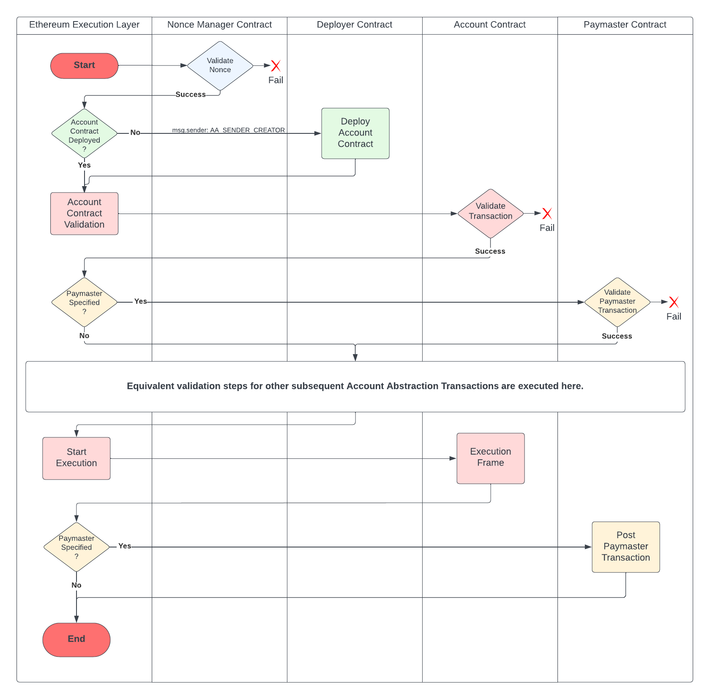
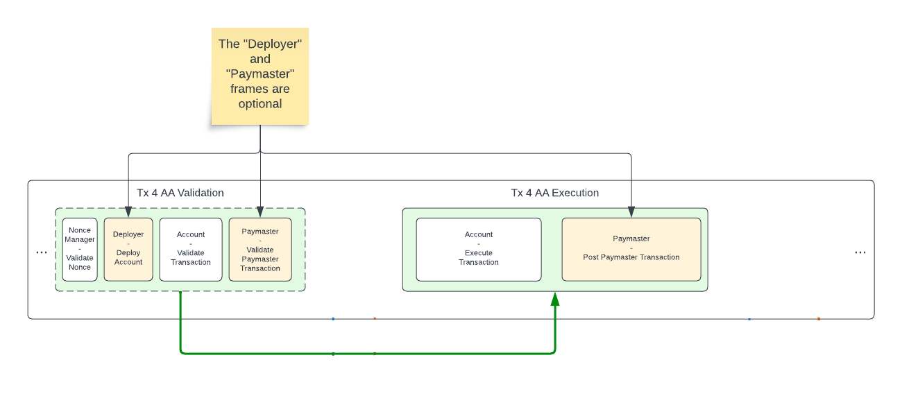

## Abstract

Combining the [EIP-2938](https://eips.ethereum.org/EIPS/eip-2938)
and [ERC-4337](https://eips.ethereum.org/EIPS/eip-4337)
into a comprehensive Native Account Abstraction proposal.

We propose splitting the Ethereum transaction scope into multiple steps: validations, execution,
and post-transaction logic.
Transaction validity is determined by the result of the validation steps of a transaction.

We further separate transaction validation for the purposes of authorization and the gas fee payment,
allowing contract B to pay gas for a transaction that will be executed from account contract A.

The benefits are in backward compatibility with the emerging ERC-4337 ecosystem while achieving the
long-term goal of Native Account Abstraction.

## Motivation

ERC-4337 can do a lot as a purely voluntary ERC. However, any of the out-of-protocol ways of achieving
Account Abstraction faces several drawbacks compared to native support. There are a few key areas where
it is weaker than a truly in-protocol solution:

* Extra gas overhead of ~42k for a basic `UserOperation` compared to ~21k for a basic transaction.

* Less benefit from in-protocol censorship resistance techniques such as crLists, which target transactions
  and would miss `UserOperations`.

* Relying on a significantly smaller set of participating nodes and non-standard RPC methods like
  `eth_sendRawTransactionConditional`.

* Inability to use `tx.origin` or contracts that rely on it as it returns the meaningless address of a bundler.

EIP-2938 defines a very mature alternative approach to Account Abstraction. However, it does not translate
well to the architecture of ERC-4337 that is being used in production without any protocol changes.
Therefore, the implementation of EIP-2938 will not benefit as much from the production experience gained by using
ERC-4337 and from maintaining backward compatibility with it.

There is also a possibility that at some point in the future, all EOAs on Ethereum will be replaced with pre-deployed
smart contracts. This, however, is impossible without an addition of Native Account Abstraction to the protocol.

## Specification

### Constants

| Name                   | Value               |
|------------------------|---------------------|
| FORK_BLOCK             | TBD                 |
| AA_TX_TYPE             | TBD                 |
| AA_ENTRY_POINT         | `address(7560)`     |
| AA_SENDER_CREATOR      | `address(ffff7560)` |
| AA_BASE_GAS_COST       | 15000               |
| VERSION                | 1                   |
| MAX_CONTEXT_SIZE       | 65536               |
| MAX_REVERT_REASON_SIZE | 1024                |


### Definitions

* *Transaction*:
  An action initiated by an account and represented by a set of input parameters.
  This action will change the state of the Ethereum blockchain when it is included in a block.
* *RIP-7560 Transaction*:
  An action initiated by a Smart Contract Account and represented with
  an [EIP-2718](https://eips.ethereum.org/EIPS/eip-2718) compatible Transaction Envelope object.
* *RIP-7560 Call Frame*:
  A single atomic element of EVM code execution,
  represented by a single top-level call to a specific address with a given data.
  An RIP-7560 call frame may contain inner call frames as well, but they are not referred to as "RIP-7560 call frames".
  An RIP-7560 call frame may either succeed or revert.
* *RIP-7560 Transaction Phase*:
  A set of RIP-7560 Call Frames that form a single step in an RIP-7560 Transaction flow.
  There are two phases in an RIP-7560 Transaction: *validation* and *execution*.
* *Paymaster*:
  A smart contract whose sole role in an RIP-7560 Transaction is to pay for its gas.

### New Transaction Type

A new [EIP-2718](https://eips.ethereum.org/EIPS/eip-2718) transaction with type AA_TX_TYPE is introduced.
Transactions of this type are referred to as
"AA transactions". Their payload should be interpreted as:

```

0x04 || 0x00 || rlp([
  chainId,
  nonceKey, nonceSequence,
  sender, senderValidationData,
  deployer, deployerData,
  paymaster, paymasterData,
  executionData,
  builderFee,
  maxPriorityFeePerGas, maxFeePerGas,
  validationGasLimit, paymasterValidationGasLimit, paymasterPostOpGasLimit
  callGasLimit,
  accessList,
  authorizationList
])

```

```
authorizationList = [[chain_id, address, nonce, y_parity, r, s], ...]
```


The base gas cost of this transaction is set to `AA_BASE_GAS_COST` instead of 21000 to reflect the lack of "intrinsic"
ECDSA signature verification.

The `authorizationList` parameter has the exact same behaviour as defined by the
[EIP-7702](https://eips.ethereum.org/EIPS/eip-7702).

### Definition of the RIP-7560 Transaction:

The following table represents a full list of fields of an RIP-7560 transaction:

| Name                          | Type           | Description                                                                         |
|-------------------------------|----------------|-------------------------------------------------------------------------------------|
| sender                        | DATA, 20 Bytes | Address of the Smart Contract Account making the transaction                        |
| deployer                      | DATA, 20 Bytes | Address of the Deployer - account factory contract (optional)                       |
| deployerData                  | DATA           | Data that is provided to the Deployer contract (if `deployer` is set)               |
| paymaster                     | DATA, 20 Bytes | Address of the Paymaster contract (optional)                                        |
| paymasterData                 | DATA           | Data that is provided to the Paymaster contract (if `paymaster` is set)             |
| executionData                 | DATA           | Data that is provided to the Account contract for execution                         |
| nonceKey                      | QUANTITY       | A 192 bit nonce key. Use of `nonceKey != 0` is defined in RIP-7712.                 |
| nonceSequence                 | QUANTITY       | A 64 bit nonce sequence. Use of `nonceKey != 0` is defined in RIP-7712.             |
| builderFee                    | QUANTITY       | Value passed from sender or paymaster to the `coinbase`                             |
| maxPriorityFeePerGas          | QUANTITY       | The maximum gas price to be included as a tip to the validator                      |
| maxFeePerGas                  | QUANTITY       | The maximum fee per unit of gas                                                     |
| validationGasLimit            | QUANTITY       | Gas provided for the transaction account validation frame                           |
| paymasterValidationGasLimit   | QUANTITY       | Gas provided for the transaction paymaster validation frame (if `paymaster` is set) |
| paymasterPostOpGasLimit       | QUANTITY       | Gas provided for the transaction paymaster `postOp` frame (if `paymaster` is set)   |
| callGasLimit                  | QUANTITY       | Gas provided for the transaction RIP-7560 execution call frame                      |
| accessList                    | OBJECT         | An EIP-2930 compatible Access List structure                                        |
| EIP-7702 authorizations (WIP) | ARRAY          | An EIP-7702 compatible list of contracts injected into EOAs                         |
| authorizationData             | DATA           | Data that will be used by the Account to verify transaction                         |

### Definition of the RIP-7560 Transaction Receipt:

A transaction receipt object shape is modified to support the RIP-7560 transaction receipts.

| Name                         | Type             | Description                                                                                                                          |
|------------------------------|------------------|--------------------------------------------------------------------------------------------------------------------------------------|
| sender                       | DATA, 20 Bytes   | Address of the sender of this transaction                                                                                            |
| paymaster                    | DATA, 20 Bytes   | Address of the Paymaster if it is paying for the transaction, `null` otherwise                                                       |
| deployer                     | DATA, 20 Bytes   | Address of the Deployer if it is included in the transaction, `null` otherwise                                                       |
| senderCreationGasUsed        | QUANTITY         | The amount of gas actually used by the sender deployment frame, or zero if frame not executed                                        |
| senderValidationGasUsed      | QUANTITY         | The amount of gas actually used by the sender validation frame                                                                       |
| paymasterValidationGasUsed   | QUANTITY         | The amount of gas actually used by the paymaster validation frame, or zero if frame not executed                                     |
| executionGasUsed             | QUANTITY         | The amount of gas actually used by the RIP-7560 execution call frame                                                                 |
| postOpGasUsed                | QUANTITY         | The amount of gas actually used by the paymaster `postOp` frame, or zero if frame not executed                                       |
| executionStatus              | QUANTITY         | 0 (success), 1 (execution reverted), 2 (`postOp` reverted), 3 (both execution and `postOp` reverted) status of the execution frame   |
| validationLogs               | ARRAY            | Array of log objects, which this transaction'S VALIDATION FRAME generated.                                                           |
| transactionHash              | DATA, 32 Bytes   | Hash of the transaction.                                                                                                             |
| transactionIndex             | QUANTITY         | Integer of the transactions index position in the block.                                                                             |
| blockHash                    | DATA, 32 Bytes   | Hash of the block where this transaction was in.                                                                                     |
| blockNumber                  | QUANTITY         | Block number where this transaction was in.                                                                                          |
| cumulativeGasUsed            | QUANTITY         | The total amount of gas used when this transaction was executed in the block.                                                        |
| effectiveGasPrice            | QUANTITY         | The sum of the base fee and tip paid per unit of gas.                                                                                |
| gasUsed                      | QUANTITY         | The amount of gas used by this specific transaction alone.                                                                           |
| logs                         | ARRAY            | Array of log objects, which this transaction'S EXECUTION FRAME generated.                                                            |
| logsBloom                    | DATA, 256 Bytes  | Bloom filter for light clients to quickly retrieve related logs.                                                                     |
| type                         | QUANTITY         | Integer of the transaction type                                                                                                      |

### Gas fees are charged directly from the contract balance

The maximum gas cost of the `AA_TX_TYPE` transaction is defined as:

```

maxPossibleGasCost = AA_BASE_GAS_COST +
  validationGasLimit +
  paymasterValidationGasLimit +
  callGasLimit +
  paymasterPostOpGasLimit

```

If `paymaster` is not specified, the `maxPossibleGasCost` is charged up-front, before any computation is done in any
execution frame, from the balance of the `sender` address.
If `paymaster` is specified, the gas cost is charged from its balance.
The transaction is invalid if the balance of the account that is being pre-charged,
whether it is a `sender` or a `paymaster`, is insufficient.
After the transaction finishes its execution, the address that was pre-charged may receive a gas refund.

The meanings of the `maxPriorityFeePerGas` and `maxFeePerGas` are unchanged from how they are defined in the
[EIP-1559](https://eips.ethereum.org/EIPS/eip-1559).

### Gas fees charged for transaction input

For all the existing transaction types, G_txdatazero (4 gas) and G_txdatanonzero (16 gas) per byte is
charged for the `data` parameter.

Transaction Type AA_TX_TYPE introduces the following dynamic length inputs: `executionData`, `paymasterData`,
`deployerData`, `authorizationData`. Each of these parameters' gas cost is counted towards transaction data cost.
This transaction data gas cost is referred to as `calldataGasUsed` and is subtracted from the `validationGasLimit`
before execution of the transaction.
The transaction is considered INVALID if `validationGasLimit` is smaller than `calldataGasUsed`.

### Builder Fee

As we need to account for an additional off-chain work that block builders have to perform to
include `AA_TX_TYPE` transactions in their blocks, as well as a potential L1 gas cost for builders
operating on L2 rollups, and given that this work does not correspond to the amount of gas spent on
validation and is not linked to the gas price, the `sender` may decide
to pay an extra `builderFee` as a "tip" to the block builder.

This value is denominated in wei and is passed from the `sender`, or the `paymaster` if it is specified,
to the `coinbase` of the current block as part of the gas pre-charge.

### Multiple execution frames for a single transaction

All existing transaction types only have an implicit validation phase where balance, nonce, and signature are checked,
and a single top-level execution frame with
`tx.origin == msg.sender` which is the address that is determined by a transaction ECDSA signature.

When processing a transaction of type `AA_TX_TYPE`, however, multiple execution frames will be created.
The full list of possible frames tries to replicate the ERC-4337 flow:

1. Validation Phase
   * `sender` deployment frame (once per account)
   * `sender` validation frame (required)
   * `paymaster` validation frame (optional)
2. Execution Phase
   * `sender` execution frame (required)
   * `paymaster` post-transaction frame (optional)

All execution frames in the "Validation Phase" must be completed successfully without reverting, and
both `sender` and `paymaster` validation frames must include a call to a corresponding `AA_ENTRY_POINT`
approval callback functions
in order for the transaction to be considered valid for a given position in a block.

In all top-level frames, the global variables have the following meaning:

| Opcode Name | Solidity Equivalent | Value                                                                         |
|-------------|---------------------|-------------------------------------------------------------------------------|
| `CALLER`    | `msg.sender`        | The `AA_ENTRY_POINT` address. `AA_SENDER_CREATOR` for the "deployment frame". |
| `ORIGIN`    | `tx.origin`         | The transaction `sender` address                                              |
| `CALLDATA*` | `msg.data`          | The transaction data is set to inputs of the corresponding frame              |

### Transaction execution context

Note that some behaviours in the EVM depend on the transaction context. These behaviours are:
1. Costs of the SSTORE opcode per [EIP-2200](../eip-2200)
2. Costs of accessing cold addresses and slots per [EIP-2929](../eip-2929)
3. Values available within the transient storage per [EIP-1163](../eip-1163)
4. Maximum amount of gas refund assigned after the execution per [EIP-3529](../eip-3529)
5. Availability of the SELFDESTRUCT opcode per [EIP-6780](../eip-6780)

These features are not affected by the separation of the transaction into multiple frames.
Meaning, for example, that a value set with TSTORE in one frame will remain available in the next one.

#### Sender deployment frame

The `deployer` address is invoked with the `deployerData` as call data input from the `AA_SENDER_CREATOR` address.

The gas limit of this frame is set to `validationGasLimit`.
The amount of gas used by this frame is referred to as `senderCreationGasUsed`.

The sender deployment frame MUST result in the `sender` address becoming
initialized with contract code.

#### Sender validation frame

We define the following Solidity struct to represent the AA transaction on-chain:

```solidity

struct TransactionTypeRIP7560 {
    address sender;
    address paymaster;
    address deployer;
    uint256 nonceKey;
    uint256 nonceSequence;
    uint256 builderFee;
    uint256 maxFeePerGas;
    uint256 maxPriorityFeePerGas;
    uint256 validationGasLimit;
    uint256 paymasterValidationGasLimit;
    uint256 paymasterPostOpGasLimit;
    uint256 callGasLimit;
    bytes senderValidationData;
    bytes paymasterData;
    bytes deployerData;
    bytes executionData;
    address[] authorizationList;
    bool[] authorizationListStatus;
}

```

Note that the `authorizationList` struct parameter only includes the list of addresses recovered from each element
of the RLP-encoded transaction payload.

As there is a gas cost associated with providing any element of the `authorizationList` regardless of its validity,
and in order to avoid repeated `ecrecover` executions in on-chain validation,
we introduce the `authorizationListStatus` struct parameter.
Its elements contain `true` for entries that did result in setting the EOA code, and `false` otherwise.

We then define the following Solidity method and the `sender` of the transaction is invoked with the corresponding data:

```solidity

function validateTransaction(uint256 version, bytes32 txHash, bytes transaction) external;

```

The gas limit of this frame is set to `validationGasLimit - senderCreationGasUsed - calldataGasUsed`.\
The `transaction` parameter is interpreted as an ABI encoding of `TransactionTypeRIP7560`.\
The `txHash` parameter represents the hash of the AA_TX_TYPE transaction with empty `authorizationData`,
as defined in section
[Calculation of Transaction Type AA_TX_TYPE hash](#calculation-of-transaction-type-aatxtype-hash).\
The `version` parameter is added in order to maintain the Solidity method ID in case of changes to this struct
in future revisions of this EIP.

The amount of gas used by this frame is referred to as `senderValidationGasUsed`.

We then define the following Solidity methods as an `AA_ENTRY_POINT` approval callback function:

```solidity
function acceptAccount(uint256 validAfter, uint256 validUntil) external;
```

```solidity
function sigFailAccount(uint256 validAfter, uint256 validUntil) external;
```

Calls to the `AA_ENTRY_POINT` approval callbacks have the following meaning:

- `acceptAccount` - This callback is called by the account after it verified the transaction and agreed to pay for its execution.
- `sigFailAccount` - This callback is called by the account if the transaction is syntactically valid,
but the `authorizationData` is incorrect.\
Note that this callback is used during gas estimation and does **not** indicate a valid transaction.

The parameters passed to the callback functions have the following meaning:

- **validAfter** - a timestamp. The transaction is valid only after this time.
- **validUntil** - a timestamp. The transaction is valid only up to this time. Zero is a special value meaning "valid indefinitely".

The account MUST make exactly one call to the `AA_ENTRY_POINT` to be considered valid.
Any other outcome, such as the account not making any calls to the `AA_ENTRY_POINT` callbacks,
making any call other than `acceptAccount`,
making multiple calls to the `AA_ENTRY_POINT`,
or causing a reverted execution is considered to fail validation,
and the transaction is rejected and not included on-chain.

#### Paymaster validation frame

The `paymaster` of the transaction, if specified, is invoked with the following data:

```solidity
function validatePaymasterTransaction(uint256 version, bytes32 txHash, bytes transaction) external;
```

The gas limit of this frame is set to `paymasterValidationGasLimit`.

The amount of gas used by this frame is referred to as `paymasterValidationGasUsed`.

- The `version` parameter is `VERSION`
- The `transaction` parameter is interpreted as an ABI encoding of `TransactionTypeRIP7560`.\
- The `txHash` parameter represents the hash of the AA_TX_TYPE transaction with empty `authorizationData`,
as defined in section
[Calculation of Transaction Type AA_TX_TYPE hash](#calculation-of-transaction-type-aatxtype-hash).


We then define the following Solidity methods as an `AA_ENTRY_POINT` approval callback function:

```solidity
function acceptPaymaster(uint256 validAfter, uint256 validUntil, bytes context);
```

```solidity
function sigFailPaymaster(uint256 validAfter, uint256 validUntil, bytes context);
```

Calls to the `AA_ENTRY_POINT` approval callbacks have the following meaning:

- `acceptPaymaster` - This callback is called by the paymaster after it verified the transaction and agrees to pay for its execution.
- `sigFailPaymaster` - This callback is called by the paymaster if its `paymasterData` is expected to contain
  some kind of signature, but it does not contain a valid one.\
  Note that this callback is used during gas estimation and does **not** indicate a valid transaction.

The parameters passed to the callback functions have the following meaning:

- `validAfter`, `validUntil` - same as defined in `acceptAccount`
- `context` - optional byte array provided by the paymaster contract, which is later passed to `postPaymasterTransaction`.
The length of this value MUST NOT exceed `MAX_CONTEXT_SIZE` bytes.


The paymaster MUST make exactly one call to the `AA_ENTRY_POINT` to be considered valid.
Any other outcome, such as the paymaster not making any calls to the `AA_ENTRY_POINT` callbacks,
making any call other than `acceptPaymaster`,
making multiple calls to the `AA_ENTRY_POINT`,
or causing a reverted execution is considered to fail validation,
and the transaction is rejected and not included on-chain.

#### Sender execution frame

The `sender` address is invoked with `executionData` input.

The gas limit of this frame is set to `callGasLimit`.\
Calculation of the `calldataGasUsed` value is defined in the
[Gas fees charged for transaction input](#gas-fees-charged-for-transaction-input) section.\
The amount of gas used by this frame is referred to as `gasUsedByExecution`.

The validation frames do not revert even if the execution frame reverts.
The `postPaymasterTransaction` may still be called with a `success: false` flag.

#### Paymaster post-transaction frame

After the sender execution frame is over the `paymaster` may need to perform some post-transaction logic,
for instance to perform some kind of cleanup or bookkeeping.
If the gas payment validation frame provided a non-zero `context` in the `acceptPaymaster` callback,
the `paymaster` is invoked again with the following inputs:

```solidity

function postPaymasterTransaction(bool success, uint256 actualGasCost, bytes context) external;

```

- `success` indicates whether this transaction's execution frame completed without revert.
- `actualGasCost` parameter is the actual amount of gas spent by the paymaster for this transaction up to this point. Note that it does not include the gas cost of the `postPaymasterTransaction` function itself.

The gas limit of this frame is set to `paymasterPostOpGasLimit`.

Revert in the `postPaymasterTransaction` frame reverts the transaction's execution frame as well.
The gas fees charged from the `paymaster` will include the validation frames and also gas cost of the reverted execution frame and postPaymasterTransaction frame.

### System Transaction Events

We define the following system-level events that are emitted as part of an RIP-7560 transaction:

```solidity
    event RIP7560TransactionEvent(
        address indexed sender,
        address indexed paymaster,
        address indexed deployer,
        uint256 nonce,
        uint256 executionStatus
    );

    event RIP7560TransactionRevertReason(
        address indexed sender,
        uint256 nonce,
        bytes revertReason
    );

    event RIP7560TransactionPostOpRevertReason(
        address indexed sender,
        address indexed paymaster,
        uint256 nonce,
        bytes revertReason
    );
```

* `RIP7560TransactionEvent` event is emitted in the end of each RIP-7560 transaction.

* `RIP7560TransactionRevertReason` event is emitted if the RIP-7560 transaction's execution frame
  has reverted with a non-zero length return data.

* `RIP7560TransactionPostOpRevertReason` event is emitted if the RIP-7560 transaction Paymaster's "postOp" call
  has reverted with a non-zero length return data.

The bytes array returned as the `revertReason` parameter is truncated to its maximum length of `MAX_REVERT_REASON_SIZE`.
Any data returned above that length will not be observable in a transaction receipt.

The gas cost of System Transaction Events is not charged separately and is covered by the `AA_BASE_GAS_COST`
of a transaction.

The values for the `executionStatus` are the following:

* `success` = 0
* `executionFailure` = 1
* `postOpFailure` = 2
* `executionAndPostOpFailure` = 3

### Execution flow diagram

The execution flow determined by an Account Abstraction Transaction is visualised by the following flow diagram:


*Execution flow for the Native Account Abstraction Transactions*

### Execution layer transaction validation

On the execution layer, the transaction validity conditions for a block are extended as follows:

```go

func validateAccountAbstractionTransaction(tx *Transaction) {
    assert !(sender.code.length > 0 && deployer != address(0))

    if (sender.code.length == 0 && deployer != address(0)) {
        calldataGasUsed := calculateCallDataGasUsed(tx)
        retDeployer, error := evm.Call(
            from: AA_SENDER_CREATOR,
            to: deployer,
            input: deployerData,
            gas: validationGasLimit - calldataGasUsed)
        assert error == nil
        assert sender.code.length > 0
    }

    senderInput := ABI.encodeWithSelector('validateTransaction', tx, tx.hash);
    callbackParamsSender, error := evm.Call(
        from: AA_ENTRY_POINT,
        to: sender,
        input: senderInput,
        gas: validationGasLimit - retDeployer.gasUsed)
    assert error == nil
    assert callbackParamsSender != nil
    assert Date.now() <= callbackParamsSender.validUntil
    assert Date.now() >= callbackParamsSender.validAfter
    assert callbackParamsSender.isValidAuthorizationData

    if (paymaster != address(0)) {
        paymasterInput := ABI.encodeWithSelector('validatePaymasterTransaction', tx, tx.hash)
        callbackParamsPaymaster, error := evm.Call(
            from: AA_ENTRY_POINT,
            to: paymaster,
            input: paymasterInput,
            gas: paymasterValidationGasLimit)
        assert error == nil
        assert callbackParamsPaymaster != nil
        assert Date.now() <= callbackParamsPaymaster.validUntil
        assert Date.now() >= callbackParamsPaymaster.validAfter
        assert callbackParamsPaymaster.isValidAuthorizationData
    }
}

```

In order to defend from DoS attack vectors, the block builders SHOULD consider
the opcode banning and storage access rules described in [ERC-7562](https://eips.ethereum.org/EIPS/eips/eip-7562).

[Block validation](#execution-layer-block-validation) takes roughly the same amount of work as without AA transactions.
In any case, validation must execute the entire block in order to verify the state change.
During this execution, it currently verifies signatures, nonces, and gas payment.
With Account Abstraction, it will also verify that all the validation frames were successful.
There is a slight increase in required memory mostly used to store the `context` value that is passed from
the `paymaster` validation frame to its post-transaction frame.

As long as all transaction validation steps execute successfully and provide correct values
to their `AA_ENTRY_POINT` callbacks, the block is considered valid.
Block builders who are willing to relax the rules applied to the validation frames MAY do so.

### Transaction flow diagram

Zooming into a single transaction, the validation part of an AA transaction may include multiple execution frames:


*Frames within a single Native Account Abstraction Transaction within a block*

### Transaction validity time range parameters

The `Paymaster validation frame` and the `Sender validation frame` each provide values for `validUntil` and `validAfter`.

These values allow the `sender` and `paymaster` contracts to specify
a time range for the blocks the transaction will be valid for.

Transaction cannot be included in a block outside of this time range.
If included, such a block is considered invalid.

Passing `validUntil = 0` and `validAfter = 0` disables the check.

### Calculation of Transaction Type AA_TX_TYPE hash

```

keccak256(AA_TX_TYPE || 0x00 || rlp(transaction_payload)

```

Note that the `chainId`, `accessList` and `authorizationList` parameters are included in the transaction hash
calculation but are not available on-chain as part of the `TransactionTypeRIP7560` struct.

In order to calculate the transaction hash that will be used during the signing of the transaction and validation of
the transaction signature by the `sender`, the value of the `authorizationData` parameter is considered to be an empty
byte array.

## Rationale

### Using Solidity method selectors in a Core EIP

The contracts that have a role in this Account Abstraction proposal, such as `sender` or `paymaster`,
MUST know which code to execute and understand the calldata provided to them in order to validate the transaction.

We argue that the most straightforward implementation is to rely on Solidity 4-byte method selectors as it is an
established de-facto standard.

### Calling the `deployer` from the `AA_SENDER_CREATOR` address

It is important that the `deployer` is **not** invoked from the `AA_ENTRY_POINT` but from the `AA_SENDER_CREATOR`.

This is necessary to guarantee that `AA_ENTRY_POINT` may never initiate a call to a `sender` execution function
without first completing a successful validation.
Without this protection, as we do not control the `deployerData` field, it may be constructed to look like
a legitimate call from the `AA_ENTRY_POINT` to the `sender`.

### Usage of `AA_ENTRY_POINT` approval callbacks

The successful validation frame execution in the context of a smart contract leads to a transaction gas payment.
It is important to prevent any unsuspecting contract from being tricked into "accepting" an
RIP-7560 transaction validation, which may lead to this contract being drained.

To do so we require specific call to the `AA_ENTRY_POINT` address to indicate RIP-7560 transaction acceptance.

### The Usage of `sigFailAccount` and `sigFailPaymaster` for `authorizationData` check failure

This callback is called by an account or a paymaster during their respective validation frames if they can verify
all relevant details of the transaction except for the transaction `authorizationData`.

This callback is used during gas estimation, and it helps wallet and apps to determine the gas used by the validation
process before generating any real signatures.\
The transaction is expected to consume the same amount of gas when updated with a valid `authorizationData`.

### System Transaction Events

These events are equivalents to the events emitted by the `EntryPoint.sol` contract in ERC-4337.
They provide a set of features that are not generally available through an existing Ethereum API.

Among those are the ability to fetch recent transactions initiated by a given `sender`, `paymaster` or `factory`,
as well as observing a transaction revert reasons for included transactions.

It is very likely that existing ERC-4337 infrastructure depends on these events for its basic functions,
so we retain these events in RIP-7560 as well.

## Backwards Compatibility

This EIP preserves most of the design elements established by the ERC-4337. This allows the same client code and smart
contracts to be used in both systems with minimal to no modifications, while providing significant UX improvements.

Existing contracts are not significantly affected by the change.
The assumption that `tx.origin` is guaranteed to be an EOA is no longer valid.
The assumption that `tx.origin` is the address that pays for the current transaction is no longer valid as well.

Any code that expects a single top-level execution frame for an Ethereum transaction will have to accommodate
the new transaction type.

[EIP-3607](https://eips.ethereum.org/EIPS/eip-3607) introduces a ban on transactions from senders with deployed code.
This limitation does not apply to AA_TX_TYPE transactions.

### Migration path for existing ERC-4337 projects and further roadmap

#### Existing bundlers can co-exist on the network

The ERC-4337 is not a protocol change and may remain operational in parallel to this EIP indefinitely.
Given the similarity to ERC-4337, the same block builders may easily support both ERC-4337 and `AA_TX_TYPE` transactions.

#### Accounts need to upgrade their `EntryPoint` to an adapter contract

The team behind ERC-4337 will provide a reference implementation of a contract converting
the ABI of the `paymaster` and `sender` contracts. This adapter can be set as a trusted
`EntryPoint` address by the ERC-4337 contracts.

#### Supporting ERC-4337 RPC calls as a compatibility layer

The `sender` contracts MAY support both ERC-4337 and `AA_TX_TYPE` transactions during a transition period,
as long as this EIP may be adopted by some chains and not by others.

## Security Considerations

This EIP creates a complex and sophisticated mechanism and aims to expand the usage of Smart Contract Accounts.
All of it creates a lot of new risk vectors and attack surfaces.

The following is a non-exhaustive list of known security considerations regarding Native Account Abstraction.

### Directly charging the balance of a contract

This EIP adds a new way for a smart contract to have its balance charged simply by making a valid callback call
to the `AA_ENTRY_POINT` address from a
function with method ID that corresponds to `validateTransaction`, `validatePaymasterTransaction`.

This creates a new kind of risk for contracts that accidentally or maliciously contain such methods but are not public
about the fact that these contracts can be used as a `sender` or a `paymaster` in an `AA_TX_TYPE` transaction.

This concern is mitigated by requiring these contracts to call `acceptAccount` or `acceptPaymaster` callbacks
on the `AA_ENTRY_POINT` address, which makes contracts' interaction with the `AA_ENTRY_POINT` address explicit.
Code reviewers should be aware of this feature of RIP-7560 transactions.

### Observing revert reasons in a validation frame

Existing transaction types get included in a block even if reverted and provide a revert reason for debugging purposes.
There is a very short list of things that can cause a transaction not to be included on-chain:

* low gas fee
* insufficient balance
* invalid nonce
* censorship

This is not the case for reverts that occur in the validation phase of an `AA_TX_TYPE` transaction.
In order to address this developers should track the validity of these transactions being signed and are encouraged
to rely on the `validUntil` time range parameter to guarantee a transaction that has not been included in the intended time
will not become valid again unexpectedly for the user who had sent it.

### Denial of Service attacks on the block builder

It is important to consider the ability of the block builder to fill the block with transactions in the allotted time.

In terms of block validity, all validation and RIP-7560 execution call frames may read and write any state when included in the block.
This means that transactions are technically able to invalidate each other.

Block builders may face a risk of having multiple eligible
transactions being invalidated by a single transaction once they include it in a block, causing the Denial of Service.
Sequencer-like block builders do not have such a risk as long as they process incoming transactions
in the order they are received.

As part of the mitigation, the AA transactions SHOULD be bound by storage access rules to avoid
DoS on block builders.
These rules are defined in [ERC-7562](https://eips.ethereum.org/EIPS/eips/eip-7562).

The full mitigation may be achieved by separating the validation from into a separate context as described in the
[RIP-7711](./rip-7711.md).

### Atomic "validate and execute" fallback function

We recommend that Smart Contract Account developers make sure that users will be able to control their accounts
even in the event of `AA_TX_TYPE` transactions becoming unavailable for whatever reason.

This can be easily achieved by providing a public function that includes calls to both the validation and execution
handlers of the Smart Contract Account.

## Copyright

Copyright and related rights waived via [CC0](../LICENSE.md).
