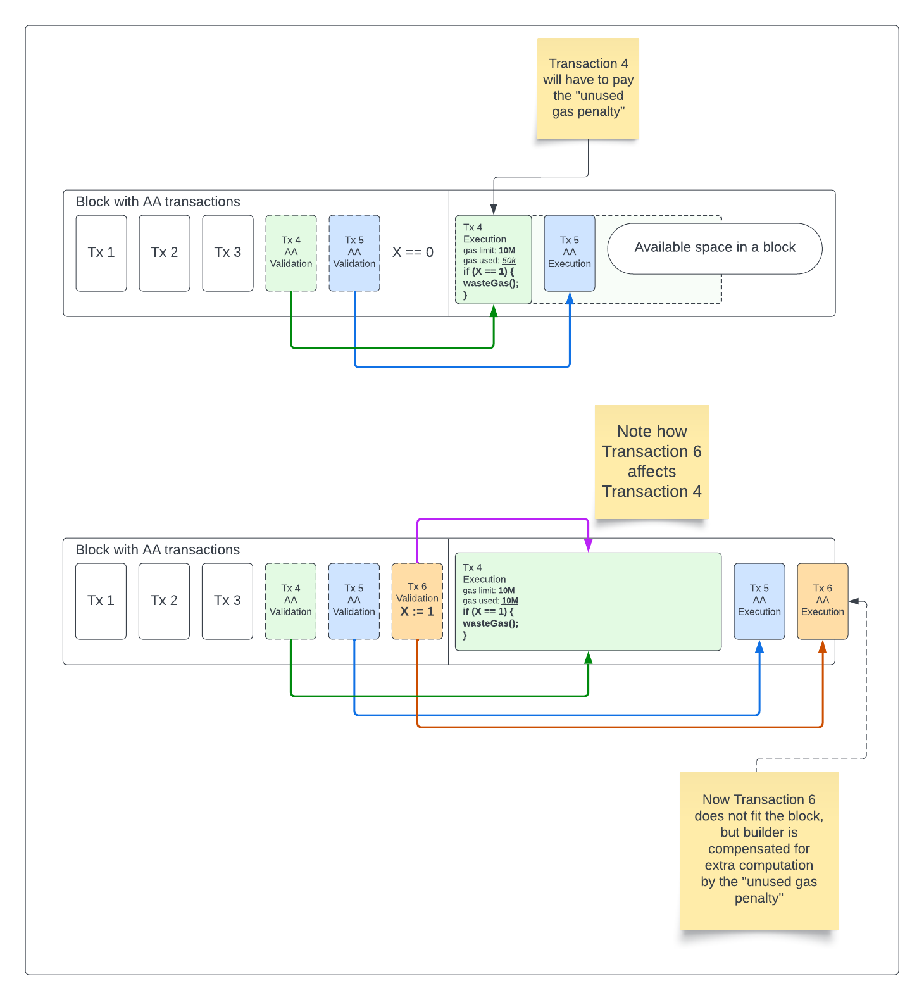

## Abstract

This proposal provides block builders with a mechanism to isolate validation from execution for
a set of RIP-7560 transactions.
By doing so we simplify the task of filling a block gas space with RIP-7560 transactions and prevent potential
denial of service attacks against block builders.

On "single sequencer" Layer 2 chains that do not have a "transaction mempool" in a traditional sense,
this proposal provides no benefit compared to the original RIP-7560.
It is required for DoS mitigation on every chain that does rely on a public mempool for block building, however.

## Motivation

The `AA_TX_TYPE` transaction type that is defined in RIP-7560 completely separates transaction validity
on a protocol level from ECDSA signatures or any other protocol-defined rules, instead allowing account's EVM code
to determine a validity of a transaction.

This validation EVM code, however, may be affected by any observable state change within a block.
A block builder trying to include a set of `AA_TX_TYPE` transactions may face a challenge of finding a combination
that fits together without invalidating each other.

The block builder has to execute the entire body of one transaction before picking the next one.
Additionally, it is not feasible to apply any limitations on the transaction execution, while it is expected that
the validation code will be constrained by the block builder with a ruleset like ERC-7562.

This document proposes a mechanism for block builder to specify a set of `AA_TX_TYPE` transactions that are guaranteed
to fit together due to a fact that all of their validation frames are executed consecutively first,
before their respective execution frames.

## Specification

### Bundle header RIP-7560 transaction type

```
BUNDLE_HEADER_TYPE = x
```

Instead, we propose to introduce an explicit "counter" transaction type.

The payload should be interpreted as:

```
0x04 || 0x01 || rlp([chainId, transactionCount])
```

Header transactions have a unique hash calculated as follows:

```
keccak256(AA_TX_TYPE || 0x01 || rlp(chainId, transactionCount, blockNumber, txIndex))
```

The `transactionCount` is required to be strictly larger than `1`.

The `blockNumber` and `txIndex` parameters are added to the hash to achieve unique header transaction IDs.

The header transactions are only used to help execution clients determine how many of the `AA_TX_TYPE` transactions
belong to each individual bundle.

The block is not valid if a header transaction is located anywhere except before a set of `AA_TX_TYPE` transactions.

Header transactions do not affect blockchain state and do not cost any gas.

### Non-atomic validation and execution transaction type

```
BUNDLE_TRANSACTION_TYPE = x
```

These transactions are completely identical to regular RIP-7560 transactions with the exceptions of being
composable into bundles.

It is important for the wallets to explicitly opt into this feature by accepting the `BUNDLE_TRANSACTION_TYPE`,
as some Smart Contract Accounts
may be created in a way that relies on atomicity between validation and execution phases.

### All validation state changes apply before all execution ones

Filling a block with AA transactions must not be a challenge for the block builder.
However, if each transaction during its execution can alter any state that affects the validity of another transaction
in the mempool, the block builder will be forced to revalidate all transactions in the mempool after each inclusion.

We mitigate that by applying all changes in all the validation frames of a sequence of AA transactions first
and all execution frames apply immediately after that.

In theory, the validation frames can also invalidate each other, but we define ways to prevent that by applying
certain rules for the mempool transactions in ERC-7562.

A builder that chooses not to enforce the rules from ERC-7562 **must** take care to re-validate each transaction
against the mid-block state at the position where it is being included into a block.
Otherwise, the resulting block is likely to end up being invalid.

### Block structure diagram

Here is a visual representation of a block that contains multiple Account Abstraction Transactions.
The validation parts of AA transactions are executed as separate transactions,
but are not represented as separate transactions in the block data.


*The structure of a block containing multiple Native Account Abstraction Transactions*

### Transaction execution context

Note that some behaviours in the EVM depend on the transaction context. These behaviours are:
1. Costs of the `SSTORE` opcode per [EIP-2200](../eip-2200)
2. Costs of accessing cold addresses and slots per [EIP-2929](../eip-2929)
3. Values available within the transient storage per [EIP-1163](../eip-1163)
4. Maximum amount of gas refund assigned after the execution per [EIP-3529](../eip-3529)

These features are not affected by the separation of the transaction into multiple frames.
Meaning, for example, that a value set with TSTORE in one frame will remain available in the next one,
and different transactions will have independent values held in TSTORE slots.

### Behaviour of the `SELFDESTRUCT` opcode
The only exception to the rule defined in the [Transaction execution context](#transaction-execution-context)
section is the availability of the `SELFDESTRUCT` opcode as defined by [EIP-6780](../eip-6780).
Using `SELFDESTRUCT` is only allowed within the same **frame** the contract was created in.

### Unused gas penalty charge

```
UNUSED_GAS_PENALTY = 10
```

A penalty of `UNUSED_GAS_PENALTY` percent of the unused `callGasLimit` and `paymasterPostOpGasLimit` is charged from the
transaction `sender` or `paymaster`.

This penalty is applied to the execution frame and the `postPaymasterTransaction` separately.
The unused gas is calculated as following for the corresponding frames:

```
uint256 unusedGasExecution = executionGasLimit - gasUsedByExecution;
uint256 unusedExecutionGasPenalty = unusedGasExecution * UNUSED_GAS_PENALTY / 10;
```

Note that the `unusedExecutionGasPenalty` is added to the `actualGasUsed` right after the
execution frame completes and before it is passed to the the `postPaymasterTransaction` frame.

```
uint256 unusedGasPostOp = paymasterPostOpGasLimit - gasUsedByPostOp;
uint256 unusedPostOpGasPenalty = unusedGasPostOp * UNUSED_GAS_PENALTY / 10;
```

The `unusedPostOpGasPenalty` is added to the `actualGasUsed` after the `postPaymasterTransaction`.

## Rationale

### Unused gas penalty charge

Transactions of type `BUNDLE_TRANSACTION_TYPE` that reserve a lot of gas for themselves using `validationGasLimit`,
`paymasterGasLimit` and `callGasLimit` fields but do not use the reserved gas present a challenge for
block builders. This is especially demanding in case a gas used by a transaction can be significantly different
based on its position within a block, as such transactions may cause the block builder to iterate its algorithm
many times until a fully utilized block is discovered.

The effects of allowing transactions to specify unrestricted gas limits is shown on this diagram:


### Using a header transaction to carry metadata instead of adding a field to the block payload

While in this particular case there is no execution frame that needs to happen for
a `BUNDLE_HEADER_TYPE` transaction, in other similar scenarios it is possible we
will require some execution for a header transaction.

For example, in the upcoming Signature Aggregation RIP, the header transaction contains
the execution of the aggregated signature verification code.

For consistency with potential future extensions to the RIP-7560 it seems reasonable to
introduce a transaction type that has zero execution frames.
In addition, it couldn't be efficiently represented as one field because a block may contain any number of such bundles.

### Breaking up a transaction flow into non-atomic pieces

While changing the transaction flow is a departure from the norm for Ethereum transactions,
in practice this change is both very useful and not very complex.

The validation frames can be easily constrained with both gas limits and opcode bans.
The entire validation section of a correctly built bundle can therefore be protected from containing
mutually exclusive transactions.
The task of building a block becomes efficient and can be parallelized with no risk of DoS attacks.

For the EVM implementation the validation frames behave almost identical to a standalone transaction,
so there are no expected difficulties with implementing this proposal.

## Backwards Compatibility


## Security Considerations

### Attacks on validation-execution separation

Accounts in RIP-7560 are instructed not to expect the validation and execution to be atomic.
However, wallets may be implemented with an incorrect assumption that nothing can happen
between validation and execution phases, which is wrong.

The state that exists at the end of the validation frame may be observed or modified by unrelated contracts before
the execution frame begins.
`Sender` contracts must take great care in making sure their code does not make any false assumptions.

## Copyright

Copyright and related rights waived via [CC0](../LICENSE.md).
