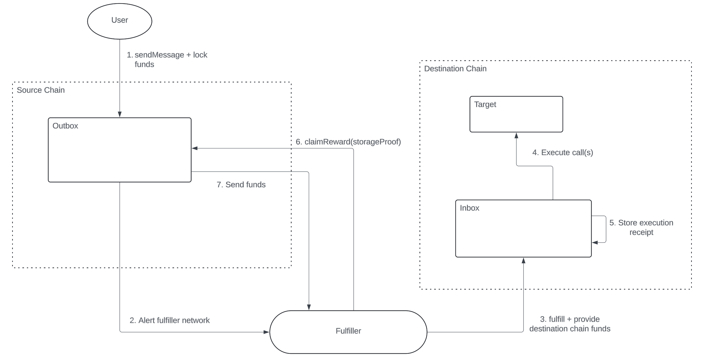

## Abstract

This proposal introduces a standard for facilitating cross-chain calls within the Ethereum ecosystem. It aims to minimize trust assumptions by means of a proof system that leverages state sharing between Ethereum and its rollups. This proof system verifies destination chain call execution, enabling secure compensation for offchain agents that process requested transactions.

## Motivation

Cross-chain interactions are fundamental to the modern cryptocurrency user experience. Current solutions for Ethereum networks face several key limitations:

1. Dependence on centralized, permissioned relayers
1. Reliance on protocols external to Ethereum and its rollups
1. Abstracted, intent-based architectures that restrict direct control over execution

Ethereum L2s, which all record state in a shared execution environment, are well-suited to provide an alternative. Users of EVM chains should have access to a public, decentralized utility for executing cross-chain calls.

From any EVM chain, users should be able to initiate a call on any other EVM chain while utilizing a compensation mechanism to influence the probability of its execution.

Users must have complete assurance that compensation is only provided if the call is executed. This assurance should rely solely on onchain information.

## Specification

The system relies on three main components:

- Message Passing Contracts: A source chain `Outbox` and a destination chain `Inbox` for sending / receiving messages as well as processing fulfiller compensation.
- Relayers: Sophisticated offchain actors (called "fulfillers") that relay messages to destination chains on behalf of users.
- Settlement Layer: A mechanism for validating destination chain call delivery to allow fulfiller compensation on source chain.

This proposal assumes all Ethereum L2s post state representations to Ethereum mainnet. L2s that expose L1 state within their execution environment gain a unique capability: they can prove the state of any other L2 connected to Ethereum. This fundamental property enables the trustless settlement layer via EIP-1186 storage proofs that are described in detail below.

### Request Flow



1. User submits request with reward funds to `Outbox`
1. `Outbox` emits discovery event
1. Fulfiller relays request to destination chain's `Inbox`, including any required execution funds
1. `Inbox` executes the requested cross-chain calls
1. `Inbox` stores execution receipt in contract storage
1. After a specified delay, fulfiller submits proof to `Outbox`
1. Upon successful proof validation, reward is released to fulfiller

> [!NOTE]
>
> - The following specifications use syntax from Solidity `0.8.24` (or above).

### Data Structures

#### Call

Represents a low-level call specification for a transaction on the destination chain.

Fields:

- `to`: Address to be called converted to a bytes32 format
- `data`: Calldata for the call
- `value`: Native asset value for the call

```solidity
struct Call {
    bytes32 to;
    bytes data;
    uint256 value;
}
```

### Outbox

The Outbox contract, deployed on the origin chain, manages cross-chain call requests and reward distributions. It validates request fulfillment through storage proofs and must implement the following interface.

#### Events

##### MessagePosted

Emitted when a user initiates a cross-chain call request.

**Parameters:**

- `messageId` (bytes32, indexed): Keccak256 hash of the message request
- `sourceChain` (bytes32) The chain identifier of the source chain
- `sender` (bytes32) The account address of the sender
- `destinationChain` (bytes32) The chain identifier of the destination chain
- `receiver` (bytes32) The account address of the receiver
- `payload` (bytes) The encoded message to be executed on the destination chain
- `attributes` (bytes[]) The attributes to be included in the message

```solidity
event MessagePosted(
    bytes32 indexed messageId,
    bytes32 sourceChain,
    bytes32 sender,
    bytes32 destinationChain,
    bytes32 receiver,
    bytes payload,
    bytes[] attributes
);
```

##### CrossChainCallCompleted

Emitted when a fulfiller successfully claims their reward for executing a cross-chain call.

**Parameters:**

- `messageId` (bytes32, indexed): Keccak256 hash of the message request
- `submitter` (address): Address of the fulfiller that claimed

```solidity
event CrossChainCallCompleted(bytes32 indexed messageId, address submitter);
```

##### CrossChainCallCanceled

Emitted when an expired request is canceled.

**Parameters:**

- `messageId` (bytes32, indexed): Keccak256 hash of the message request

```solidity
event CrossChainCallCanceled(bytes32 indexed messageId);
```

#### Methods

##### sendMessage

Initiates a cross-chain call request.

**Requirements:**

- Must emit `MessagePosted`
- Must lock the reward amount in the contract
- Must specify the receiver as either an `Inbox` contract on the destination chain, or the ERC-4337 `EntryPoint` contract
- The payload is either an encoded `Call` array, or an encoded `UserOp`
- See [Cross-Chain UserOps](#cross-chain-user-operations) for account abstraction considerations

```solidity
function sendMessage(
    bytes32 destinationChain,
    bytes32 receiver,
    bytes calldata payload,
    bytes[] calldata attributes
) external payable returns (bytes32);
```

##### claimReward

Allows fulfillers to claim rewards by providing proof of successful cross-chain execution.

**Requirements:**

- Must verify the proof
- Must emit `CrossChainCallCompleted` event
- Must transfer reward to the specified `payTo` address

```solidity
function claimReward(
    bytes32 destinationChain,
    bytes32 receiver,
    bytes calldata payload,
    bytes[] calldata attributes,
    bytes calldata proof,
    address payTo
) external;
```

##### cancelRequest

Cancels an expired request and refunds the reward.

**Requirements:**

- Must verify request expiration
- Must emit `CrossChainCallCanceled`
- Must refund reward to original requester

```solidity
function cancelMessage(
    bytes32 destinationChain,
    bytes32 receiver,
    bytes calldata payload,
    bytes[] calldata attributes
) external;
```

### Inbox

The inbox contract on the destination chain functions as a router for requested calls and maintains a receipt of request fulfillment.

#### Data Structures

##### FulfillmentInfo

This structure holds details about the fulfillment of a request.

Fields:

- `timestamp`: The block timestamp when the request was fulfilled.
- `fulfiller`: The address of the entity that successfully completed the call.

```solidity
struct FulfillmentInfo {
    uint96 timestamp;
    address fulfiller;
}
```

#### Events

##### CallFulfilled

This event is emitted when a cross-chain call request is fulfilled.

**Parameters**:

- `messageId`: The keccak256 hash of the message request.
- `fulfilledBy`: The address of the entity that successfully completed the call.

```solidity
event CallFulfilled(bytes32 indexed messageId, address indexed fulfilledBy);
```

#### Methods

##### fulfill

This method routes the requested calls to specified destinations and records a receipt of the fulfillment.

**Requirements:**

- Must execute requested `Call`'s
- Must emit `CallFulfilled` event
- Once `FulfillmentInfo` is stored, the receipt is immutable
- Must only store `FulfillmentInfo` if all calls are successful

Note: The caller specifies a custom fulfiller address, allowing a different address to claim rewards.

```solidity
function fulfill(
    bytes32 sourceChain,
    bytes32 sender,
    bytes calldata payload,
    bytes[] calldata attributes,
    address fulfiller
) external payable;
```

### Storage Proof Validation

Storage proof validation is used within the Outbox contract to ensure the execution receipt exists in the destination chain `Inbox` storage before releasing a reward to the fulfiller. Storage proof validation implementations are chain-specific, which is why the `claimReward` function in the `Outbox` contract accepts the `proof` parameter as a generic `bytes` type. While specific proof formats may vary between implementations, all should follow this core validation sequence:


> [!NOTE]
> Visual elements in diagram:
>
> - Networks: Gray background
> - Contracts: Purple background
> - Storage values: Yellow background
>
> Chain definitions:
>
> - Chain A: Source chain
> - Chain B: Destination chain
>
> This example shows validation steps for an L2 -> L1 -> L2 route

Validation Steps:

1. Verify that the proof's beacon root corresponds to the root exposed in Chain A's execution environment.
1. Verify L1 execution client's state root against the beacon root.
1. Verify Chain B's rollup contract storage root against L1 execution client's state root.
1. Verify Chain B's state root against its rollup contract storage root.
1. Verify Chain B's inbox contract storage root against Chain B's state root.
1. Verify the `FulfillmentInfo` struct at the specified storage key against Chain B's inbox contract storage root.

**Important Implementation Note:**
Some L2 chains store an "output root" on L1 instead of directly storing their state root. In these cases, an additional validation step is required between steps 4 and 5. This step must:

1. Provide the destination chain's state root
2. Apply chain-specific logic to derive the output root using the state root and any auxiliary data
3. Verify the derived output root matches the proven value in the destination chain's rollup contract on L1

### Message Customization

The message or request structure allows flexibility to customize the behavior of the message delivery on destination chain as well as the settlement system for verification. This flexibility is achieved through the use of ERC-7786 inspired attributes. Each attribute is a bytes string beginning with a 4 byte selector followed by abi-encoded data.

#### [REQUIRED] Nonce Attribute

- Selector: `0xce03fdab`
- Contents:
  - Nonce value (`uint256`)

The nonce attribute prevents message ID clashing by ensuring all requests are unique. The Outbox is expected to validate the existence and correctness of the provided nonce.

#### [REQUIRED] Delay Attribute

- Selector: `0x84f550e0`
- Contents:
  - Finality delay (`uint256`)
  - Expiry (`uint256`)

The delay attribute is required for setting request expiration. It can also optionally set a finality delay that is used to prevent the fulfiller from claiming their reward too soon. That's necessary if the proof is against unfinalized state for an optimistic rollup. If the proof is against finalized state, the finality delay is unnecessary and can be ignored by the Outbox. The expiration is required in all cases and is used to ensure fulfillers have enough time to claim rewards after request delivery without the possibility of users taking their funds back.

##### Request Flow with Finality Delay


##### Cancelled Request Flow


#### [OPTIONAL] Precheck Attribute

- Selector: `0xbef86027`
- Contents:
  - Destination chain Precheck contract address (`bytes32`)

The precheck mechanism allows the requester to guarantee some destination chain condition is true in order for their request to be delivered. This is done by deploying a precheck contract to the destination chain that validates some arbitrary condition. The precheck contract must implement the following interface and is invoked before request fulfillment.


**Requirements:**

- Must revert if validation conditions are not met
- Includes the cross chain request and caller address as parameters. Caller is the address of the fulfiller that submitted the transaction to `Inbox`.

```solidity
function precheckCall(
    bytes32 sourceChain,
    bytes32 sender,
    bytes calldata payload,
    bytes[] calldata attributes,
    address caller
) external view;;
```

#### [OPTIONAL] MagicSpend Attribute

- Selector: `0x92041278`
- Contents:
  - Currency contract address (`address`)
  - Currency amount (`uint256`)

The magic spend attribute allows for requesting funds from a paymaster during call execution. This can be beneficial to fulfillers as it makes it clear which currencies are needed for call execution and removes the complexity of fulfillers needing to parse the individual calls to determine that for themselves.


This requires access to a paymaster contract that implements the following interface. This likely can only be secure if the paymaster contract is owned by the inbox.

**Requirements:**

- Must revert if `fulfiller` has an insufficient balance of `token` in the paymaster
- Must send `amount` of `token` to the `Inbox` contract

```solidity
function fulfillerWithdraw(address fulfiller, address token, uint256 amount) external;
```

#### [OPTIONAL] Reward Attribute

- Selector: `0xa362e5db`
- Contents:
  - Asset contract address (`bytes32`)
  - Asset amount (`uint256`)

The reward attribute allows the requester to specify the reward to be locked in the outbox contract as fulfiller compensation.

#### [OPTIONAL] Inbox Attribute

- Selector: `0xbd362374`
- Contents:
  - Inbox contract address on destination chain (`bytes32`)

The inbox attribute specifies the contract of the 7755 `Inbox` contract on the destination chain. With standard requests (requests where the payload is an encoded `Call` array), this is not needed since the `receiver` is the `Inbox` contract. However, for cross-chain UserOps, this attribute should be considered required.

#### [OPTIONAL] Requester Attribute

- Selector: `0x3bd94e4c`
- Contents:
  - Requester address (`bytes32`)

Allows the requester address to be tied to the 7755 request.

#### [OPTIONAL] L2 Oracle Attribute

- Selector: `0x7ff7245a`
- Contents:
  - L2 Oracle Address (`address`)

The L2 Oracle attribute allows the requester to specify the rollup contract address on L1. This is the contract that should be storing state representation for the destination chain and will be used within the settlement layer verification.

### Cross-Chain User Operations

Account abstraction (AA) techniques introduced in ERC-4337 have seen widespread adoption across multiple blockchain networks. This success creates a robust ecosystem that the RRC-7755 standard can leverage to address several challenges - the most important being enabling permissioned cross-chain calls.

#### UserOp Integration

If a 7755 request was a 4337 UserOp submitted to the destination chain's `EntryPoint` contract, we solve the `msg.sender` problem since the call execution would route directly through the user's smart account. The caveat here is the 7755 `Inbox` contract then needs to become a 4337 paymaster to:

1. Remove the need for the smart account to pay gas for the transaction
1. Uphold the Inbox contract's core invariant of producing execution receipts when a UserOp succeeds

For this reason, message payloads can also be an encoded 4337 `UserOp` instead of an encoded `Call` array. If the message is a UserOp, the `receiver` field in the message should point to the destination chain's `EntryPoint` contract, and the Inbox attribute becomes required to specify the destination chain's Inbox contract.

#### UserOp Attributes and Execution Flow

When using UserOps, the attributes array in the 7755 message should be empty as the attributes would then be expected to be embedded in the UserOp itself. With that in place, the message ID derivation can borrow existing 4337 UserOp hash derivation mechanisms.


The execution flow for a UserOp-based cross-chain call is as follows:

1. Fulfiller submits UserOp to destination chain `EntryPoint` contract. The UserOp is expected to utilize the 7755 `Paymaster` contract.
2. `EntryPoint` calls `validateUserOp` in user's Smart Account.
3. `EntryPoint` calls `validatePaymasterUserOp` in 7755 `Paymaster` contract. The `Paymaster` contract confirms the fulfiller has pre-deposited necessary funds to pay for gas + lend for call execution.
4. `EntryPoint` calls `exec` in the user's Smart Account to execute the requested calls.
5. Smart Account calls `withdrawGasExcess` in `Paymaster` if any funds are needed for call execution.
6. The `Paymaster` will only release approved funds from the validation step. These funds are sent to the Smart Account.
7. The Smart Account executes requested calls.
8. `EntryPoint` calls `postOp` in `Paymaster` with the call execution result.
9. If the call(s) were successful, the `Paymaster` calls into the 7755 `Inbox` contract to create an execution receipt for the request.
10. The `Inbox` stores the execution receipt in storage.

#### Paymaster Implementation

More specifically, within the UserOp, the `paymasterAndData` field must be encoded as follows:

The first 20 bytes of `paymasterAndData` represent the Paymaster contract address, followed by a 32-byte validation data field, with the remaining bytes containing the encoded 7755 attributes.

```solidity
(bytes[] memory attributes) = abi.decode(userOp.paymasterAndData[52:], (bytes[]));
```

The Paymaster contract must also implement the ERC-4337 paymaster interface to validate and pay for UserOps:

```solidity
function validatePaymasterUserOp(
    UserOperation calldata userOp,
    bytes32 userOpHash,
    uint256 maxCost
) external returns (bytes memory context, uint256 validationData);

function postOp(
    PostOpMode mode,
    bytes calldata context,
    uint256 actualGasCost
) external;
```

During validation, the Paymaster contract should:

1. Decode and validate the attributes from `paymasterAndData`
1. Optionally verify a precheck condition if the attributes include one
1. Ensure the fulfiller has pre-deposited enough funds to sponsor the requested calls
1. After execution, record the fulfillment information in the Inbox storage

This approach ensures that cross-chain UserOps maintain the same security guarantees as standard 7755 calls while leveraging the account abstraction capabilities of ERC-4337.

### Message ID Derivation

**StandardRequests:**

```solidity
keccak256(abi.encode(sourceChain, sender, destinationChain, receiver, payload, attributes))
```

**UserOpRequests:**

```solidity
keccak256(abi.encode(userOp.hash(), receiver.bytes32ToAddress(), uint256(destinationChain)));
```

## Rationale

Storage-based proof verification for cross-chain call execution provides cryptographic guarantees without introducing additional trust assumptions beyond Ethereum and its rollups. The Inbox contract's immutable storage design ensures that execution receipts, once stored, remain permanent and verifiable at any future time without increasing proof complexity.

The standard converts most address types to `bytes32` to maintain forward compatibility, particularly for future non-EVM chain integrations.

The separation of `rewardAsset` and `rewardAmount` enables support for diverse reward types independent of the cross-chain transaction currency. For instance, while executing a cross-chain transfer of USDC, the reward could be denominated in ETH. The fulfiller must verify that the reward's value adequately compensates for the transaction costs before processing the call.

The `finalityDelaySeconds` parameter enhances security by ensuring sufficient confidence in destination chain finality before proof submission. This is only relevant if a prover relies on unfinalized state and this security measure can adapt as L1 and L2 consensus mechanisms evolve.

The `l2Oracle` specification enables proof validation reuse across compatible chains. For instance, multiple OP Stack chains can share a single Outbox contract while maintaining separate `l2Oracle` instances.

## Security Considerations

### Storage Proof Validation Risks

Hard forks in any chain can compromise storage proof validation compatibility. This incompatibility may arise from:

- Changes to the chain's state layout (e.g., migration from Merkle Patricia Trie storage)
- Modifications to L1 data storage mechanisms

**Critical Impact**: Incompatible storage proof validation can result in locked funds in Outbox contracts. Fulfillers must actively monitor for upcoming hardforks of supported chains.

### Fulfiller Risk Management

The system architecture shifts primary risk exposure from users to fulfillers. Key risks include:

1. **Reorg Risk**: Immediate request fulfillment exposes fulfillers to potential source chain reorganizations, which may result in:

   - Transaction reversals
   - Token transfer losses

2. **Request Validation Requirements**

At a minimum, fulfillers must validate all requester-set fields against these criteria:

| Condition                              | Description                                                                                                                                                                                                                                                                                                                                   |
| -------------------------------------- | --------------------------------------------------------------------------------------------------------------------------------------------------------------------------------------------------------------------------------------------------------------------------------------------------------------------------------------------- |
| Confirm the destination chain          | Ensure the request's designated destination chain is compatible with the source chain's Outbox. Example: A request originating from an OP Stack outbox and destined for Arbitrum is invalid.                                                                                                                                                  |
| Confirm the destination chain receiver | Verify that the request's destination chain receiver is a recognized Inbox or Entrypoint address.                                                                                                                                                                                                                                             |
| Confirm the L2 Oracle                  | Check that the specified `L2Oracle` is valid for the destination chain. It should be the rollup contract address on Ethereum Mainnet that the destination chain posts state to.                                                                                                                                                               |
| Confirm the finality delay             | If the finality delay is too short, the requester could reclaim their reward before the state is provable on L1, allowing funds to be effectively stolen. If the delay is too long, the opportunity cost of locked funds becomes high.                                                                                                        |
| Confirm the offered compensation       | The fulfiller should ensure the reward covers estimated gas costs for submitting the request on the destination chain, estimated gas costs for proving the request and claiming the reward on the source chain, any required funds for execution on the destination chain, and the opportunity cost of locked funds during the finality delay |
| Validate UserOp                        | If the request is a UserOp, ensure the paymaster address is a recognized 7755 paymaster                                                                                                                                                                                                                                                       |
| Confirm fulfiller funding              | The fulfiller should confirm it has sufficient balances to cover all funds needed for destination chain call execution                                                                                                                                                                                                                        |

## Copyright

Copyright and related rights waived via [CC0](../LICENSE.md).
