## Abstract

This specification proposes a method to make cross-rollup transactions contingent on the shared Layer 1 (L1) history of communicating Layer 2 (L2) rollups. 

The aim is to highlight the importance of L2’s tracking their L1 origins and the role it plays in the finality of a rollup. By introducing L1 origin tracking as a requirement, we define how it is utilized to establish ordering guarantees between rollups before they reach their safe or finalized stages. This enhances the reliability of cross-rollup interactions by accounting for the shared L1 context between rollups pre-finality.

## Motivation

Currently, cross L2 communication is conducted independent of the L1 history that the L2 chain has been derived from. A longer post on the topic of cross L2 communication safety can be found [here](https://ethresear.ch/t/modeling-security-for-cross-rollup-interoperability/20591). The current issues with cross L2 communication are the following:

1. Validity guarantee \!= ordering guarantee. Low latency cross L2 communication today pushes reorg risk onto the apps building on top.  
2. Some cross L2 communication today violates safety invariants which can result in inconsistent state across L2s.  
3. L2s today derive their chain from various points in L1 history introducing artificial temporal latency in cross L2 communication.

### Importance of tracking L1 origins in rollups

**TLDR:** **The notion that every L2 block is produced “now” is inaccurate.** 

In reality, every rollup block is anchored to a specific Ethereum block at a configurable depth—this block is known as the **L1 origin** (see [OP Stack’s derivation docs](https://specs.optimism.io/protocol/derivation.html)).

Depending on the L1 origin or L1 history that the L2 is derived from, the L2 block is technically produced sometime in the past as it’s generally the sum of both historical L1 and current L2 inputs.’’

Let’s use an analogy here. For those of you who are familiar with the Time Variance Authority in the Marvel Cinematic Universe (or any time travel enthusiasts), the canonical Ethereum chain could be considered the “sacred timeline” from which many alternate realities branch off. 

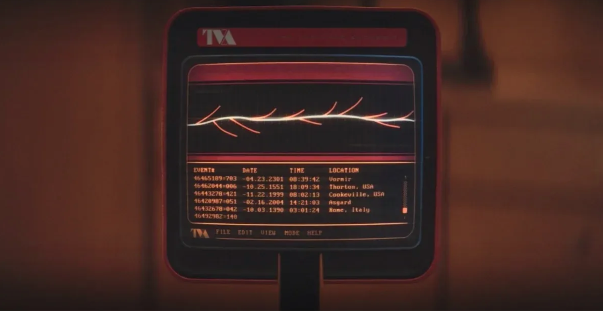

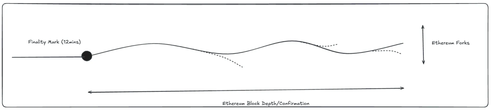

These alternate realities are analogous to Ethereum forks sub Ethereum finality. Eventually these Ethereum forks are pruned until only the sacred timeline or canonical Ethereum history remains.

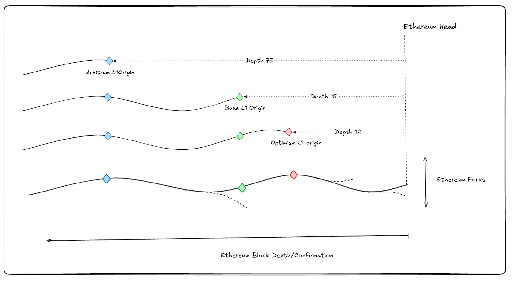

Consider the following example:

* **Arbitrum**: Suppose the latest Arbitrum block is built off Ethereum block number **75**.  
* **Base**: The latest Base block might be built off Ethereum block number **135**, but an older Base block could have been built off block number **75**.

In this scenario:

* The latest Arbitrum block has no knowledge of Ethereum blocks beyond block 75, which might include blocks that other rollups like Base and Optimism are building their latest blocks on.  
* Conversely, Base lacks information about the latest blocks of Optimism, but it does have knowledge of Arbitrum's latest L1 orgin since it has already processed Ethereum block 75\.

This means that depending on their L1 origins, different L2s might be operating with different views of the Ethereum chain. They are either "in the past", “in the future” or "in the same time" relative to one another depending on where they are anchored in the L1 history.

This will hold true if these L2s are following the same Ethereum fork, what will eventually become Ethereum’s sacred timeline. But in some cases the L2 block may be derived from an alternate reality that eventually gets pruned.  

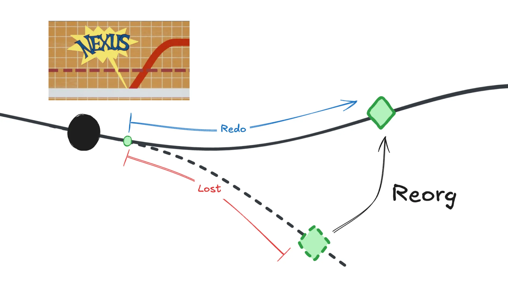

This mental model motivates a number of safety invariants for cross L2 communication that need to be enforced.

## Specification

Below, we propose a specification for enabling “safe” low latency communication across L2s by creating a contingency DAG for cross rollup transactions which represent a subset of transactions across blocks. This approach is reminiscent of [Prestwich’s proposal](https://prestwich.substack.com/p/contingency) for cross rollup contingent blocks but only establishes a contingency relationship for a subset of transactions (not entire blocks) making the protocol relatively lightweight.

There are two protocol properties that L2s should implement and adhere to.

1. Every L2 should track L1 origins via block hash and provide access to its trusted L1 history within the L2 execution environment.  
   1. Block number alone is insufficient as it doesn’t differentiate between L1 histories.  
   2. Ex. [L1Block](https://github.com/ethereum-optimism/optimism/blob/develop/packages/contracts-bedrock/src/L2/L1Block.sol/) (op)

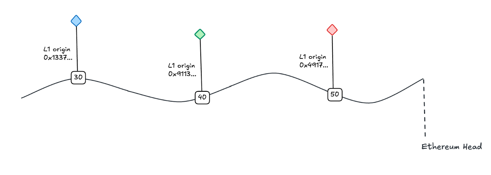

2. For cross L2 communication, the true time an L2 block is produced is the time the L1 block it’s derived from was produced under normal block production rules.  
   1. This is the time used for enforcing the safety invariants below.

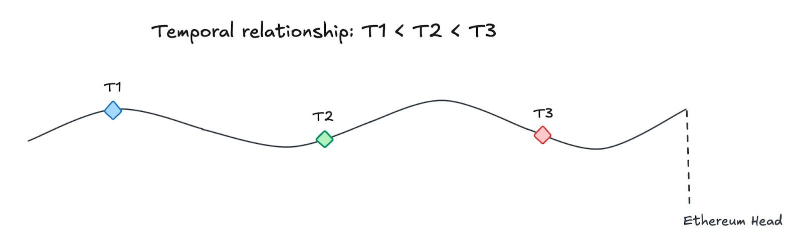

There are a few safety invariants that need to be enforced during cross L2 communication.

1. Future to past communication is not allowed.   
2. Communicating across L1 histories is not allowed.  
3. A reorg of the originating chain from which a contingency link is created must also mean a reorg of the contingent chain.   
4. A message originating from a source chain prior to reorg must not be replayable on the dependent destination chain after both chains reorg.

These safety invariants should be checked before an L2's published DA on its L1 is finalized. See appendix for more details.

### Future to past communication 

Future to past communication is unsafe due to the following case where the L2 building off of future Ethereum history may be reorged while the L2 building off of past Ethereum history does not.   

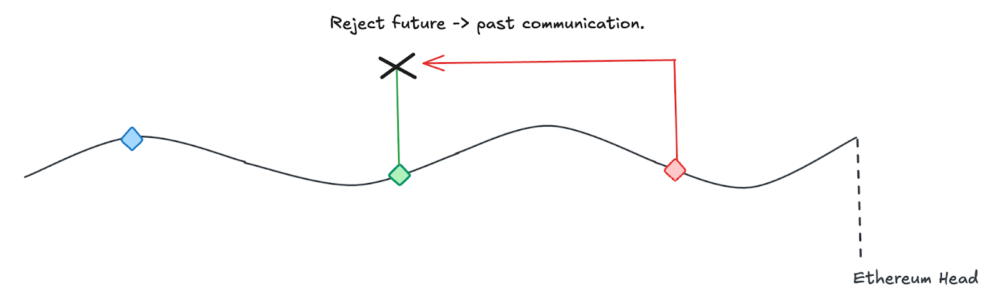 
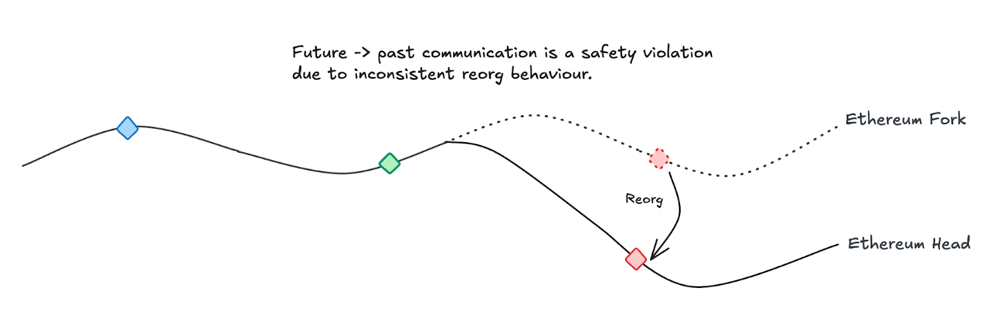

### Communicating across L1 histories

Communicating L2s must share the same L1 history for communication. Otherwise, we can end up with one L2 reorg’ing while the other L2 does not. Ensuring that both L2s are on the same history guarantees that both L2s reorg together or not at all.  

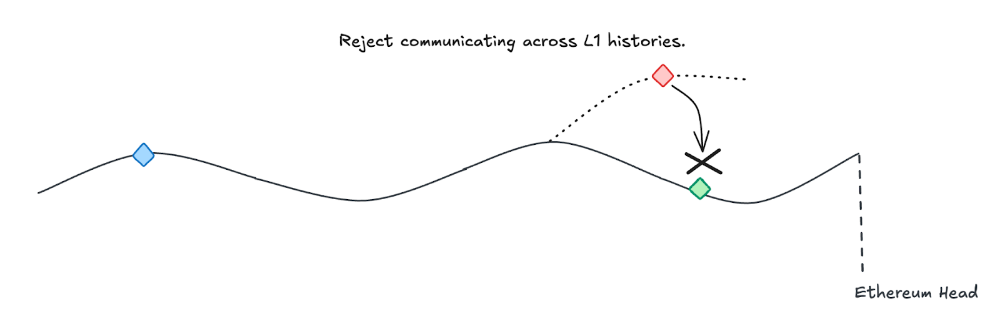

### Contingent reorg

Once a contingency relationship has been established, a reorg of the originating L2 must also mean a reorg of the contingent L2. This ensures that all downstream dependencies in the contingency DAG also revert.

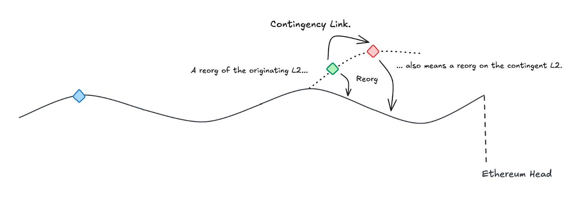

### Reorg replay

Replaying a cross chain transaction that originated from a reorged block is unsafe. The receiving chain must be able to reject replayed cross chain transactions that were generated prior to a reorg. This is enforced within the contingency DAG.

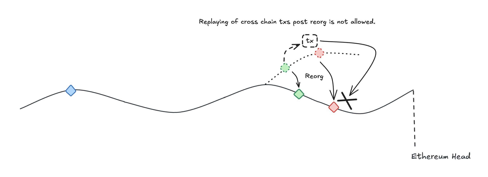

### Contingency DAG in action

Let’s go over how the contingency DAG is created and how the contingencies can be enforced in the event of a reorg. In the example below, both Optimism and Base are building L2 blocks off of the same L1 history in L1’.

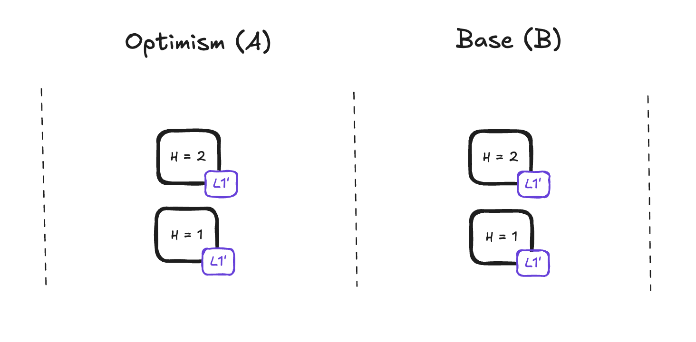

We then establish a contingency link by updated Base with the knowledge of Optimism block number 1 which is contingent upon L1 history L1’. Since Base is also building off of L1’, the contingency check passes.  

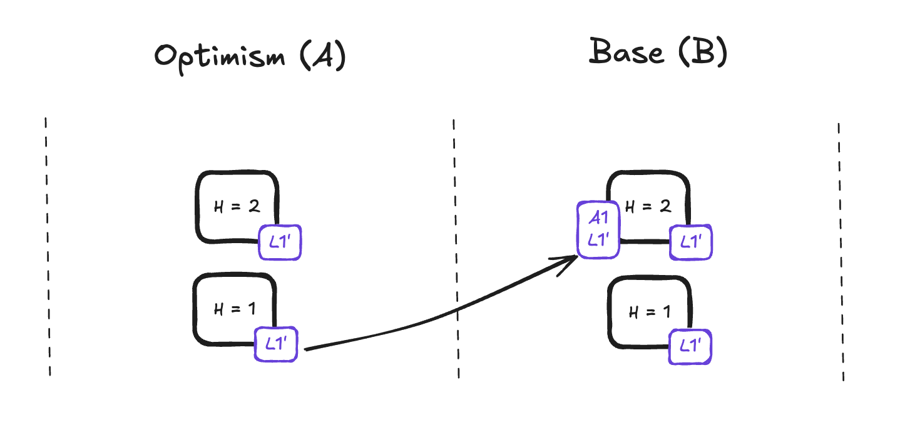

Messages C1 and C2 are sent over this newly formed contingency link between Optimism and Base. These messages are contingent upon the contingency link being formed in the first place.

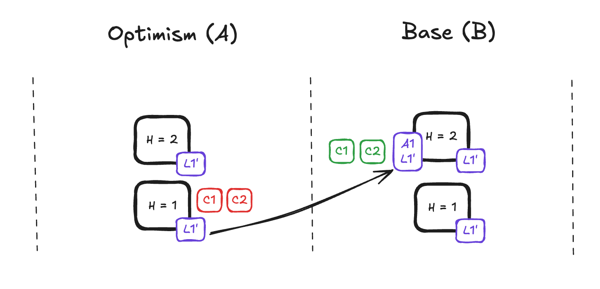

In the case that Base is building its blocks off of a different L1 history, the contingency link fails to get created and no messages are sent. This enforces the safety invariant that communicating across L1 histories is not allowed.     

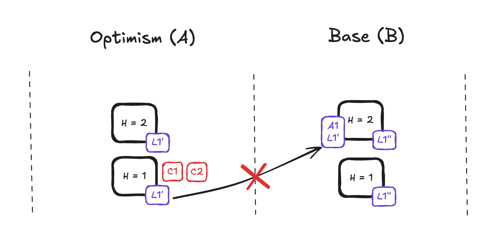

If there’s a reorg that causes both Optimism and Base to switch their L1 history from L1’ to L1’’, the contingency link also fails to get created and no messages are sent. This is correct behavior as the previous contingency link update no longer accurately represents the origin chain.  

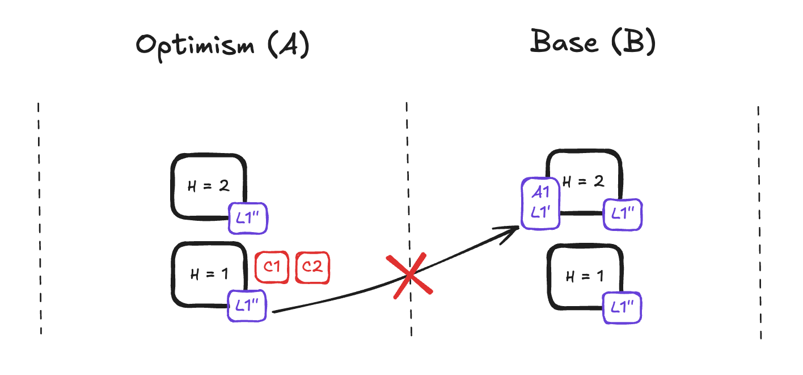

### Example Pseudocode

See below for some pseudocode for how a contingency is created between two L2s. The link is formed by both the state of the L2 and its L1 origin number and hash. There is an initial check for the validity of the L2 header. Then we perform a contingency check which compares the L1 origin block hash of the connecting L2 with the trusted L1 origin block hash of the current L2. 

```
// Not a real Ethereum L2 header, just an example.
type Header {
    ChainID         bytes
    ParentHash      bytes32
    RootHash        bytes32
    TxHash 	       bytes32
    ReceiptHash     bytes32
    Number          BigInteger
    L1OriginHash    bytes32
    L1OriginNumber  BigInteger
}

function getL2Header(bytes chainID, BigInteger number) (Header) {
  // returns L2 Header if found
  return storage.get(chainID, number);
}

function storeL2header(Header header) {
  // stores L2 header
  storage.write(header.ChainID, header.Number, header);
}

function verifyL2Header(Header header) (bool) {
  // verification logic can vary from validating header against 
  // the native rollup bridge to verifying a sequencer signature
}

function createCrossL2Contingency(Header header) {
  if (!verifyL2Header(header)) {
      return;
  }
  
  // L1Info is a pre-deployed contract that provides the trusted L1 origin 
  // within the current L2 execution environment
  bytes32 trustedOriginHash = L1Info.getBlockHash(header.L1OriginNumber);
  if (header.L1OriginHash != trustedOriginHash) {
    return;
  }

  // Create the cross L2 contingency by storing the counterparty L2 header w/ 
  // its L1 origin info.
  storeL2Header(header);
}
```

Lastly we can send contingent transactions over this contingency link using the pseudocode below. We leverage logs emitted on a counterparty L2 as the message payload of the contingent transaction. The transaction below is expected to fail upon replay when the contingency link formed above gets reverted after a reorg.

```
function verifyReceiptProof(bytes32 receiptRoot, bytes[] receiptProof) (bool) {
  // verify that the leaf of the receipt proof is linkable to the 
  // receipt root
}

function verifyLogInReceipt(bytes receipt, bytes log) (bool) {
  // verify that the provided log can be found in the transaction receipt
}

function sendCrossL2ContigentTransaction(
  bytes chainID, 
  BigInteger blockNumber, 
  bytes[] receiptProof, 
  bytes log,
  address target,
) {
  Header header = getL2Header(chainID, blockNumber);

  if (!verifyReceiptProof(header.ReceiptHash, receiptProof)) {
    return;
  }

  if (!verifyLogInReceipt(receiptProof[receiptProof.length-1])) {
    return;
  }

  // call the target with the log as the payload
  call(target, log);
}
```

In the diagrams and pseudocode above, we can see that we build a contingency DAG via links of L2 states and L1 histories. The contingency DAG itself then forms the basis upon which contingent transactions are created. The contingent transactions are dependent on the contingency links which are dependent on the shared L1 history of the communicating L2s.  

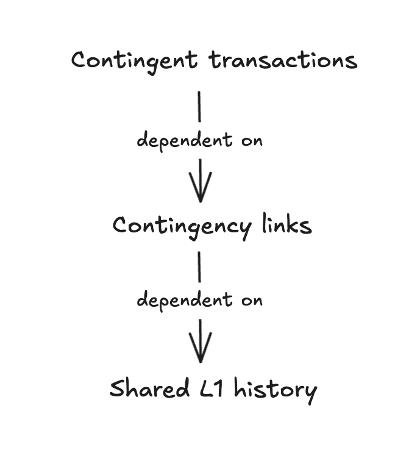

## Call to action 

We urge all rollup developers, teams, and stakeholders to take the following actions to enhance cross-rollup interoperability and ensure consistent finality:

1. **Track the L1 origins of every L2 block:**  
   * Ensure that every rollup consistently tracks **L1 origins**, updating the origin in each block if it changes.   
2. **Avoid utilizing an arbitrary confirmation depth for cross rollup interop :**  
   * Interop protocols facilitating communication across rollups should factor in shared L1 origins to avoid committing safety violations sub Ethereum finality.  
   * Otherwise, interop protocols should default to waiting for Ethereum finality instead of using arbitrary confirmation depths.   
3. **Aligning L1 origins across rollups:**   
   * By aligning on confirmation depths, rollups are temporally “co-locating” their blockspace closer together allowing for lower latency communication.  
4. **Enhance accessibility of L1 origin information:**   
   * L1 origin information should be made cheaply and easily accessible from both within the L2 execution environment and to offchain platforms like L2Beat.  
   * Providing access to historical L1 origin information is highly recommended as well.

## Appendix

Additional topics that are related to but not covered by the spec above.

### L2 -> L1 settlement

There are three phases of L2 -> L1 settlement documented in the diagram below. From block production to data availability to proving L2 execution on the L1. RIP-7789 covers the time range between when a block is produced and when the transaction data for that block has been finalized on the L1. The last phase is how validity of L2 execution is determined on the L1. 


Let’s take a closer look at the first two settlement phases through the lens of the ordering property of a rollup. The first phase represents local ordering that is sequencer guaranteed. The second phase represents global ordering that is L1 guaranteed. RIP-7789 then ensures that cross rollup transactions during this period are contingent upon **shared assumptions or shared L1 history**.

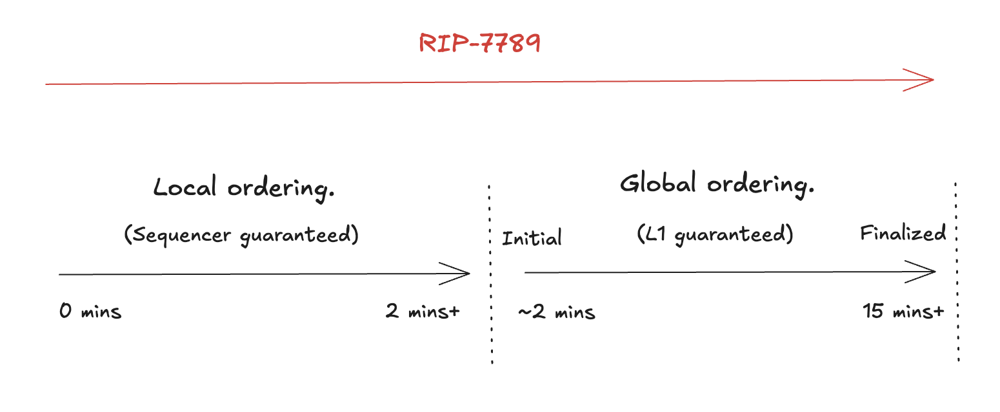

Now let’s switch the lens from ordering to validity. The first phase is a local validity guarantee made by the sequencer. Once DA has been published, a global validity guarantee can be achieved by using more secure verification mechanisms (e.g. ZK validity proof).


By taking a look at all three phases, we can see the relationship between RIP-7789 and the different validity guarantees possible during each phase. In the first two phases, RIP-7789 works in tandem with the valdiity guarantees to achieve stronger security guarantees. The third phase doesn’t require RIP-7789 to achieve the same level of security. 

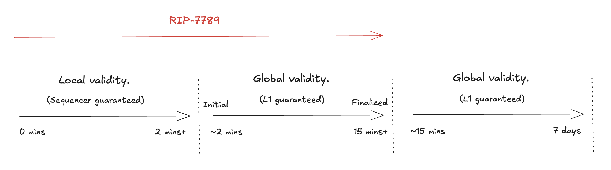

Lastly, we’ll take a look at some of the different options to achieve validity within each of the three settlement phases. The sequencer provides the strongest guarantees during the first phase. Adding additional verification mechanisms (e.g. ZK validity proofs or attestation committee) during the first phase does not add any security due to the sequencer retaining control over final ordering. 

ZK validity proofs or attestation committees can achieve validity within the time window of the second phase. Fraud proofs can be used to achieve validity during the third phase due to long latencies imposed by the fraud window. ZK validity proofs or fraud proofs have a superior trust model when compared to attestation committees.

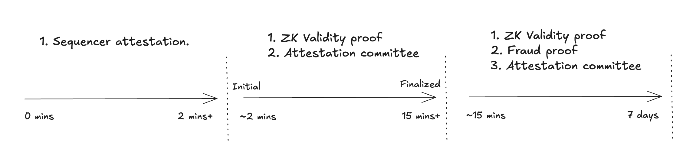
