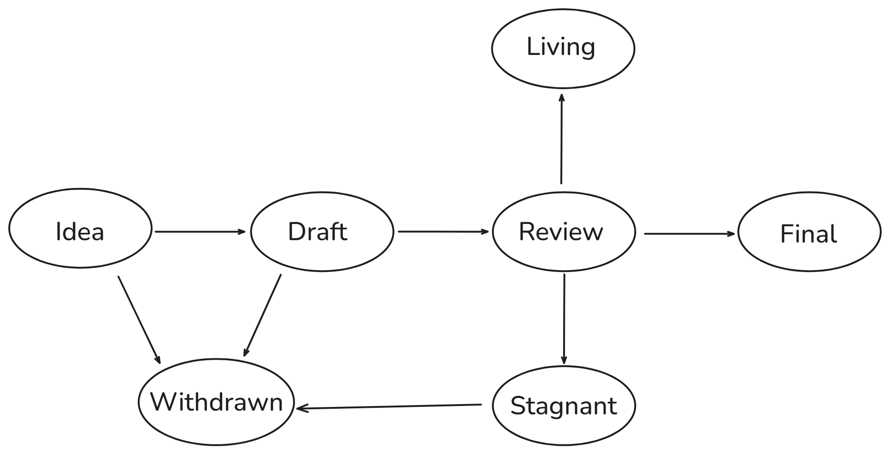

## What is an RIP?
RIP stands for Rollup Improvement Proposal. Akin to EIPs, RIPs are specification documents providing information to the Ethereum and rollups communities, or describing a new feature for rollups or their processes or environment. An RIP should provide a concise technical specification of the feature and a rationale for the feature. The RIP author is responsible for building consensus within the community. RIPs offer optional standards for RollUps, L2s, and EVM-equivalent-chains to opt into should they wish to leverage interoperability. Engaging in this process is strongly encouraged for those to whom it is relevant, as it aligns with a shared open-source development approach that promotes collaboration and transparency

## RIP Rationale

RIPs are intended to be the primary mechanism for proposing new features, for collecting community technical input on an issue, and for documenting some of the design decisions that have gone into Ethereum's rollups. Thus RIPs help to coordinate a shared improvement process for rollups. Because the RIPs are maintained as text files in a versioned repository, their revision history is the historical record of the feature proposal.

For rollups that are multiclients, RIPs are a convenient way to track the progress of their implementation. In the case of a multi client rollup, ideally, each implementation maintainer would list the RIPS and EIPs that they have implemented. End users can refer to external sources such as rollup.codes to track the differences between rollups and the Ethereum mainnet. 

## RIP Types
There are three types of RIP:

- **A Standards Track RIP** describes any change that MAY affect most or all rollups'  implementations, such as—a change to the network protocol, a change in block or transaction validity rules, proposed application standards/conventions, or any change or addition that affects the interoperability of applications using rollups. Standards Track RIPs consist of three parts—a design document, an implementation, and (if warranted) an update to the formal specification. Furthermore, Standards Track RIPs can be broken down into the following categories:

    - *Core*: improvements that would be requiring a consensus fork such as, block or transaction validity rules, EVM opcodes modifications, cryptographic primitives updates, precompiled contracts (e.g. [RIP-7728](https://github.com/ethereum/RIPs/blob/master/RIPS/rip-7728.md)), gas costs etc.
    - *RRC*: (Rollup Request for Comments) application-level standards and conventions, including contract standards such as token standards, name registries, URI schemes, library/package formats, and wallet formats, that would not be relevant in the mainnet context (e.g [RRC-7755](https://github.com/ethereum/RIPs/pull/31/files)). If an application-level standard or convention is relevant in the layer 1 context it should be an ERC and should not be duplicated as an RRC.
    - *Other* : other improvements that are relevant to core dev discussions.
    

 - A **Meta RIP** describes a process surrounding Ethereum's rollups or proposes a change to (or an event in) a process. Process RIPs are like Standards Track RIPs but apply to areas other than the Ethereum protocol itself. They may propose an implementation, but not to rollups' codebase; they often require community consensus; they are more than recommendations, and users are typically not free to ignore them. Examples include procedures, guidelines, changes to the decision-making process, and changes to the tools or environment used in Ethereum development. Any meta-RIP is also considered a Process RIP.

It is highly recommended that a single RIP contain a single key proposal or new idea. The more focused the RIP, the more successful it tends to be.

An RIP must meet certain minimum criteria. It must be a clear and complete description of the proposed enhancement. The enhancement must represent a net improvement. The proposed implementation, if applicable, must be solid and must not complicate the protocol unduly.


### Special requirements for Core RIPs

If an RIP mentions or proposes changes to the EVM, it should refer to the instructions by their mnemonics and define the opcodes of those mnemonics at least once. The L1 opcodes should be used and MUST take priority if a conflict arises. A preferred way is the following:

```
REVERT (0xfe)
```
## RIP Work Flow

### Shepherding an RIP

Parties involved in the process are you, the champion or *RIP author*, the [*RIP editors*](#rip-editors), the [*rollups core teams*](https://l2beat.com/scaling/summary) and the [*Ethereum Core Developers*](https://github.com/ethereum/pm).

Before you begin writing a formal RIP, you should vet your idea. Ask the Ethereum community first if an idea is original to avoid wasting time on something that will be rejected based on prior research. It is thus recommended to open a discussion thread on the [Ethereum Magicians forum - RIP category](https://ethereum-magicians.org/c/rips/58) to do this.

Once the idea has been vetted, your next responsibility will be to present (by means of an RIP) the idea to the reviewers and all interested parties, invite editors, developers, and the community to give feedback on the aforementioned channels. You should try and gauge whether the interest in your RIP is commensurate with both the work involved in implementing it and how many parties will have to conform to it. For example, the work required for implementing a Core RIP will be much greater than for an RRC and the RIP will need sufficient interest from the Ethereum's rollups core teams.

### Core RIPs

For Core RIPs, an author needs to convince [*rollups core teams*](https://l2beat.com/scaling/summary) to implement your RIP.

The best way to get rollups core teams to review your RIP is to present it on a Rollcall. You can request to do so by posting a comment linking your RIP on an [Rollcall agenda - GitHub issue](https://github.com/ethereum/pm/issues).  

The Rollcall serves as a way for rollups teams to discuss the technical merits and tradeoffs of various RIPs and to gauge what other rollups will be implementing. 

These calls generally result in a "rough consensus" around what RIPs should be included in the L2 core specification. This "rough consensus" rests on the assumptions that RIPs are not conflicting and can be included in the specification behind feature flags and that they are technically sound.

:warning: If you are shepherding an RIP, you can make the process of building community consensus easier by making sure that [the Ethereum Magicians forum](https://ethereum-magicians.org/) thread for your RIP includes or links to as much of the community discussion as possible and that various rollups core teams are well-represented in those.

*In short, your role as the champion is to write the RIP using the style and format described below, shepherd the discussions in the appropriate forums, and build community consensus around the idea.*

### RIP Process

The following is the standardization process for all RIPs in all tracks:




**Idea** - An idea that is pre-draft. This is not tracked within the RIP Repository.

**Draft** - The first formally tracked stage of an RIP in development. An RIP is merged by an RIP Editor into the RIP repository when properly formatted.

**Review** - An RIP Author marks an RIP as ready to implement and requesting Peer Review.

**Final** - This RIP represents the final standard. A Final RIP exists in a state of finality and should only be updated to correct errata and add non-normative clarifications.An RIP is considered final as soon as one rollup implements and deploys it to their mainnet. Care should be taken to resolve discussions & conflicts before deploying to mainnet as unresolved issues could result in a second (competing) standard emerging.


**Stagnant** - Any RIP in `Draft` or `Review` if inactive for a period of 6 months or greater is moved to `Stagnant`. An RIP may be resurrected from this state by Authors or RIP Editors through moving it back to `Draft` or its earlier status. If not resurrected, a proposal may stay forever in this status.

>*RIP Authors are notified of any algorithmic change to the status of their RIP*

**Withdrawn** - The RIP Author(s) have withdrawn the proposed RIP. This state has finality and can no longer be resurrected using this RIP number. If the idea is pursued at later date it is considered a new proposal.

**Living** - A special status for RIPs that are designed to be continually updated and not reach a state of finality. This includes most notably the present document.

## What belongs in a successful RIP?

Championing an RIP can be challenging due to the involvement of multiple stakeholders resulting from the plurality of rollups. One way to overcome this is to involve multiple rollups as early as possible in the discussion. Ideally, an author can co-write RIPs with multiple teams and ensure that the corresponding rollups are engaged.

Each RIP should have the following parts:

- Preamble - RFC 822 style headers containing metadata about the RIP, including the RIP number, a short descriptive title (limited to a maximum of 44 characters), a description (limited to a maximum of 140 characters), and the author details. Irrespective of the category, the title and description should not include RIP number. See [below](./rip-1.md#rip-header-preamble) for details.
- Abstract - Abstract is a multi-sentence (short paragraph) technical summary. This should be a very terse and human-readable version of the specification section. Someone should be able to read only the abstract to get the gist of what this specification does.
- Motivation *(optional)* - A motivation section is critical for RIPs that want to change the Ethereum protocol. It should clearly explain why the existing protocol specification is inadequate to address the problem that the RIP solves. This section may be omitted if the motivation is evident.
- Specification - The technical specification should describe the syntax and semantics of any new feature. The specification should be detailed enough to allow competing, interoperable implementations for any EVM/execution-layer platform.
- Rationale - The rationale fleshes out the specification by describing what motivated the design and why particular design decisions were made. It should describe alternate designs that were considered and related work, e.g. how the feature is supported in other languages. The rationale should discuss important objections or concerns raised during discussion around the RIP.
- Backwards Compatibility *(optional)* - All RIPs that introduce backwards incompatibilities with the Ethereum mainnet must include a section describing these incompatibilities and their consequences. If a proposal introduces backwards incompatibilities with multiple RIPs specified in this document, it must explain how the author proposes to deal with these incompatibilities. This section may be omitted if the proposal does not introduce backwards incompatibilities or incompatibilities between rollups.
- Test Cases *(optional)* - Test cases for an implementation are mandatory for RIPs that are affecting consensus changes. Tests should either be inlined in the RIP as data (such as input/expected output pairs, or included in `../assets/rip-###/<filename>`. This section may be omitted for non-Core proposals.
- Reference Implementation *(optional)* - An optional section that contains a reference/example implementation that people can use to assist in understanding or implementing this specification. This section may be omitted for all RIPs.
- Security Considerations - All RIPs must contain a section that discusses the security implications/considerations relevant to the proposed change. Include information that might be important for security discussions, surfaces risks and can be used throughout the life-cycle of the proposal. E.g. include security-relevant design decisions, concerns, important discussions, implementation-specific guidance and pitfalls, an outline of threats and risks and how they are being addressed. RIP submissions missing the "Security Considerations" section will be rejected. An RIP cannot proceed to status "Final" without a Security Considerations discussion deemed sufficient by the reviewers.
- Copyright Waiver - All RIPs must be in the public domain. The copyright waiver MUST link to the license file and use the following wording: `Copyright and related rights waived via [CC0](../LICENSE.md).`


## RIP Formats and Templates

RIPs should be written in [markdown](https://github.com/adam-p/markdown-here/wiki/Markdown-Cheatsheet) format. There is a [template](https://github.com/ethereum/EIPs/blob/master/eip-template.md) to follow.

## RIP Header Preamble

Each RIP must begin with an [RFC 822](https://www.ietf.org/rfc/rfc822.txt) style header preamble, preceded and followed by three hyphens (`---`). This header is also termed ["front matter" by Jekyll](https://jekyllrb.com/docs/front-matter/). The headers must appear in the following order.

`rip`: *RIP number*

`title`: *The RIP title is a few words, not a complete sentence*

`description`: *Description is one full (short) sentence*

`author`: *The list of the author's or authors' name(s) and/or username(s), or name(s) and email(s). Details are below.*

`discussions-to`: *The url pointing to the official discussion thread*

`status`: *Draft, Review, Final, Living, Stagnant, Withdrawn*

`type`: *One of `Standards Track` or `Meta`*

`category`: *One of `Core`, `RRC`, or `Other`* (Optional field, only needed for `Standards Track` RIPs)

`created`: *Date the RIP was created on*

`requires`: *RIP number(s)* (Optional field)

`withdrawal-reason`: *A sentence explaining why the RIP was withdrawn.* (Optional field, only needed when status is `Withdrawn`)

Headers that permit lists must separate elements with commas.

Headers requiring dates will always do so in the format of ISO 8601 (yyyy-mm-dd).

### `author` header

The `author` header lists the names, email addresses or usernames of the authors/owners of the RIP. Those who prefer anonymity may use a username only, or a first name and a username. The format of the `author` header value must be:

> Random J. User &lt;address@dom.ain&gt;

or

> Random J. User (@username)

or

> Random J. User (@username) &lt;address@dom.ain&gt;

if the email address and/or GitHub username is included, and

> Random J. User

if neither the email address nor the GitHub username are given.

At least one author must use a GitHub username, in order to get notified on change requests and have the capability to approve or reject them.

### `discussions-to` header

While an RIP is a draft, a `discussions-to` header will indicate the URL where the RIP is being discussed.

The preferred discussion URL is a topic on [Ethereum Magicians](https://ethereum-magicians.org/). The URL cannot point to Github pull requests, any URL which is ephemeral, and any URL which can get locked over time (i.e. Reddit topics).

### `type` header

The `type` header specifies the type of RIP: Standards Track or Meta. If the track is Standards please include the subcategory (core, other or RRC).

### `category` header

The `category` header specifies the RIP's category. This is required for standards-track RIPs only.

### `created` header

The `created` header records the date that the RIP was assigned a number. Both headers should be in yyyy-mm-dd format, e.g. 2001-08-14.

### `requires` header

RIPs may have a `requires` header, indicating the RIP numbers that this RIP depends on. If such a dependency exists, this field is required.

A `requires` dependency is created when the current RIP cannot be understood or implemented without a concept or technical element from another RIP. Merely mentioning another RIP does not necessarily create such a dependency.

## Linking to External Resources

Other than the specific exceptions listed below, links to external resources **SHOULD NOT** be included. External resources may disappear, move, or change unexpectedly.


### Execution Client Specifications

Links to the Ethereum Execution Client Specifications may be included using normal markdown syntax, such as:

```markdown
[Ethereum Execution Client Specifications](https://github.com/ethereum/execution-specs/blob/9a1f22311f517401fed6c939a159b55600c454af/README.md)
```

Which renders to:

[Ethereum Execution Client Specifications](https://github.com/ethereum/execution-specs/blob/9a1f22311f517401fed6c939a159b55600c454af/README.md)

Permitted Execution Client Specifications URLs must anchor to a specific commit, and so must match this regular expression:

```regex
^(https://github.com/ethereum/execution-specs/(blob|commit)/[0-9a-f]{40}/.*|https://github.com/ethereum/execution-specs/tree/[0-9a-f]{40}/.*)$
```

### Execution Specification Tests

Links to the Ethereum Execution Specification Tests (EEST) may be included using normal markdown syntax, such as:

```markdown
[Ethereum Execution Specification Tests](https://github.com/ethereum/execution-spec-tests/blob/c9b9307ff320c9bb0ecb9a951aeab0da4d9d1684/README.md)
```

Which renders to:

[Ethereum Execution Specification Tests](https://github.com/ethereum/execution-spec-tests/blob/c9b9307ff320c9bb0ecb9a951aeab0da4d9d1684/README.md)

Permitted Execution Specification Tests URLs must anchor to a specific commit, and so must match one of these regular expressions:

```regex
^https://(www\.)?github\.com/ethereum/execution-spec-tests/(blob|tree)/[a-f0-9]{40}/.+$
```

```regex
^https://(www\.)?github\.com/ethereum/execution-spec-tests/commit/[a-f0-9]{40}$
```

### Consensus Layer Specifications

Links to specific commits of files within the Ethereum Consensus Layer Specifications may be included using normal markdown syntax, such as:

```markdown
[Beacon Chain](https://github.com/ethereum/consensus-specs/blob/26695a9fdb747ecbe4f0bb9812fedbc402e5e18c/specs/sharding/beacon-chain.md)
```

Which renders to:

[Beacon Chain](https://github.com/ethereum/consensus-specs/blob/26695a9fdb747ecbe4f0bb9812fedbc402e5e18c/specs/sharding/beacon-chain.md)

Permitted Consensus Layer Specifications URLs must anchor to a specific commit, and so must match this regular expression:

```regex
^https://github.com/ethereum/consensus-specs/(blob|commit)/[0-9a-f]{40}/.*$
```

### Networking Specifications

Links to specific commits of files within the Ethereum Networking Specifications may be included using normal markdown syntax, such as:

```markdown
[Ethereum Wire Protocol](https://github.com/ethereum/devp2p/blob/40ab248bf7e017e83cc9812a4e048446709623e8/caps/eth.md)
```

Which renders as:

[Ethereum Wire Protocol](https://github.com/ethereum/devp2p/blob/40ab248bf7e017e83cc9812a4e048446709623e8/caps/eth.md)

Permitted Networking Specifications URLs must anchor to a specific commit, and so must match this regular expression:

```regex
^https://github.com/ethereum/devp2p/(blob|commit)/[0-9a-f]{40}/.*$
```

### Portal Specifications

Links to specific commits of files within the Ethereum Portal Specifications may be included using normal markdown syntax, such as:

```markdown
[Portal Wire Protocol](https://github.com/ethereum/portal-network-specs/blob/5e321567b67bded7527355be714993c24371de1a/portal-wire-protocol.md)
```

Which renders as:

[Portal Wire Protocol](https://github.com/ethereum/portal-network-specs/blob/5e321567b67bded7527355be714993c24371de1a/portal-wire-protocol.md)

Permitted Networking Specifications URLs must anchor to a specific commit, and so must match this regular expression:

```regex
^https://github.com/ethereum/portal-network-specs/(blob|commit)/[0-9a-f]{40}/.*$
```

### World Wide Web Consortium (W3C)

Links to a W3C "Recommendation" status specification may be included using normal markdown syntax. For example, the following link would be allowed:

```markdown
[Secure Contexts](https://www.w3.org/TR/2021/CRD-secure-contexts-20210918/)
```

Which renders as:

[Secure Contexts](https://www.w3.org/TR/2021/CRD-secure-contexts-20210918/)

Permitted W3C recommendation URLs MUST anchor to a specification in the technical reports namespace with a date, and so MUST match this regular expression:

```regex
^https://www\.w3\.org/TR/[0-9][0-9][0-9][0-9]/.*$
```

### Web Hypertext Application Technology Working Group (WHATWG)

Links to WHATWG specifications may be included using normal markdown syntax, such as:

```markdown
[HTML](https://html.spec.whatwg.org/commit-snapshots/578def68a9735a1e36610a6789245ddfc13d24e0/)
```

Which renders as:

[HTML](https://html.spec.whatwg.org/commit-snapshots/578def68a9735a1e36610a6789245ddfc13d24e0/)

Permitted WHATWG specification URLs must anchor to a specification defined in the `spec` subdomain (idea specifications are not allowed) and to a commit snapshot, and so must match this regular expression:

```regex
^https:\/\/[a-z]*\.spec\.whatwg\.org/commit-snapshots/[0-9a-f]{40}/$
```

Although not recommended by WHATWG, RIPs must anchor to a particular commit so that future readers can refer to the exact version of the living standard that existed at the time the RIP was finalized. This gives readers sufficient information to maintain compatibility, if they so choose, with the version referenced by the RIP and the current living standard.

### Internet Engineering Task Force (IETF)

Links to an IETF Request For Comment (RFC) specification may be included using normal markdown syntax, such as:

```markdown
[RFC 8446](https://www.rfc-editor.org/rfc/rfc8446)
```

Which renders as:

[RFC 8446](https://www.rfc-editor.org/rfc/rfc8446)

Permitted IETF specification URLs MUST anchor to a specification with an assigned RFC number (meaning cannot reference internet drafts), and so MUST match this regular expression:

```regex
^https:\/\/www.rfc-editor.org\/rfc\/.*$
```

### Bitcoin Improvement Proposal

Links to Bitcoin Improvement Proposals may be included using normal markdown syntax, such as:

```markdown
[BIP 38](https://github.com/bitcoin/bips/blob/3db736243cd01389a4dfd98738204df1856dc5b9/bip-0038.mediawiki)
```

Which renders to:

[BIP 38](https://github.com/bitcoin/bips/blob/3db736243cd01389a4dfd98738204df1856dc5b9/bip-0038.mediawiki)

Permitted Bitcoin Improvement Proposal URLs must anchor to a specific commit, and so must match this regular expression:

```regex
^(https://github.com/bitcoin/bips/blob/[0-9a-f]{40}/bip-[0-9]+\.mediawiki)$
```

### National Vulnerability Database (NVD)

Links to the Common Vulnerabilities and Exposures (CVE) system as published by the National Institute of Standards and Technology (NIST) may be included, provided they are qualified by the date of the most recent change, using the following syntax:

```markdown
[CVE-2023-29638 (2023-10-17T10:14:15)](https://nvd.nist.gov/vuln/detail/CVE-2023-29638)
```

Which renders to:

[CVE-2023-29638 (2023-10-17T10:14:15)](https://nvd.nist.gov/vuln/detail/CVE-2023-29638)

### Chain Agnostic Improvement Proposals (CAIPs)

Links to a Chain Agnostic Improvement Proposals (CAIPs) specification may be included using normal markdown syntax, such as:

```markdown
[CAIP 10](https://github.com/ChainAgnostic/CAIPs/blob/5dd3a2f541d399a82bb32590b52ca4340b09f08b/CAIPs/caip-10.md)
```

Which renders to:

[CAIP 10](https://github.com/ChainAgnostic/CAIPs/blob/5dd3a2f541d399a82bb32590b52ca4340b09f08b/CAIPs/caip-10.md)

Permitted Chain Agnostic URLs must anchor to a specific commit, and so must match this regular expression:

```regex
^(https://github.com/ChainAgnostic/CAIPs/blob/[0-9a-f]{40}/CAIPs/caip-[0-9]+\.md)$
```

### Ethereum Yellow Paper

Links to the Ethereum Yellow Paper may be included using normal markdown syntax, such as:

```markdown
[Ethereum Yellow Paper](https://github.com/ethereum/yellowpaper/blob/9c601d6a58c44928d4f2b837c0350cec9d9259ed/paper.pdf)
```

Which renders to:

[Ethereum Yellow Paper](https://github.com/ethereum/yellowpaper/blob/9c601d6a58c44928d4f2b837c0350cec9d9259ed/paper.pdf)

Permitted Yellow Paper URLs must anchor to a specific commit, and so must match this regular expression:

```regex
^(https://github\.com/ethereum/yellowpaper/blob/[0-9a-f]{40}/paper\.pdf)$
```

### Execution Client Specification Tests

Links to the Ethereum Execution Client Specification Tests may be included using normal markdown syntax, such as:

```markdown
[Ethereum Execution Client Specification Tests](https://github.com/ethereum/execution-spec-tests/blob/d5a3188f122912e137aa2e21ed2a1403e806e424/README.md)
```

Which renders to:

[Ethereum Execution Client Specification Tests](https://github.com/ethereum/execution-spec-tests/blob/d5a3188f122912e137aa2e21ed2a1403e806e424/README.md)

Permitted Execution Client Specification Tests URLs must anchor to a specific commit, and so must match this regular expression:

```regex
^(https://github.com/ethereum/execution-spec-tests/(blob|commit)/[0-9a-f]{40}/.*|https://github.com/ethereum/execution-spec-tests/tree/[0-9a-f]{40}/.*)$
```
### Rollup codes

Links to the website rollup.codes may be included, using normal markdown syntax, such as: 

```markdown
[rollup.codes](https://www.rollup.codes/)
```

Which renders to:

[rollup.codes](https://www.rollup.codes/)

### L2BEAT

Links to the website rollup.codes may be included, using normal markdown syntax, such as: 

```markdown
[L2BEAT](https://l2beat.com/scaling/summary)
```

Which renders to:

[L2BEAT](https://l2beat.com/scaling/summary)

### Digital Object Identifier System

Links qualified with a Digital Object Identifier (DOI) may be included using the following syntax:

````markdown
This is a sentence with a footnote.[^1]

[^1]:
    ```csl-json
    {
      "type": "article",
      "id": 1,
      "author": [
        {
          "family": "Sovereign",
          "given": "Rollup"
        }
      ],
      "DOI": "00.0000/a00000-000-0000-y",
      "title": "An Interesting Article",
      "original-date": {
        "date-parts": [
          [2022, 12, 31]
        ]
      },
      "URL": "https://sly-hub.invalid/00.0000/a00000-000-0000-y",
      "custom": {
        "additional-urls": [
          "https://example.com/an-interesting-article.pdf"
        ]
      }
    }
    ```
````

Which renders to:

<!-- markdownlint-capture -->
<!-- markdownlint-disable code-block-style -->

This is a sentence with a footnote.[^1]

[^1]:
    ```csl-json
    {
      "type": "article",
      "id": 1,
      "author": [
        {
          "family": "Sovereign",
          "given": "Rollup"
        }
      ],
      "DOI": "00.0000/a00000-000-0000-y",
      "title": "An Interesting Article",
      "original-date": {
        "date-parts": [
          [2022, 12, 31]
        ]
      },
      "URL": "https://sly-hub.invalid/00.0000/a00000-000-0000-y",
      "custom": {
        "additional-urls": [
          "https://example.com/an-interesting-article.pdf"
        ]
      }
    }
    ```

<!-- markdownlint-restore -->

See the [Citation Style Language Schema](https://resource.citationstyles.org/schema/v1.0/input/json/csl-data.json) for the supported fields. In addition to passing validation against that schema, references must include a DOI and at least one URL.

The top-level URL field must resolve to a copy of the referenced document which can be viewed at zero cost. Values under `additional-urls` must also resolve to a copy of the referenced document, but may charge a fee.

## Linking to other RIPs or EIPs

References to other RIPs or EIPs should follow the format `RIP-N` where `N` is the RIP number you are referring to.  Each RIP or EIP that is referenced in an RIP **MUST** be accompanied by a relative markdown link the first time it is referenced, and **MAY** be accompanied by a link on subsequent references.  The link **MUST** always be done via relative paths so that the links work in this GitHub repository, forks of this repository, the main EIPs site, mirrors of the main RIP site, etc.  For example, you would link to this RIP as `./rip-1.md`.

## Auxiliary Files

Images, diagrams and auxiliary files should be included in a subdirectory of the `assets` folder for that RIP as follows: `assets/rip-N` (where **N** is to be replaced with the RIP number). When linking to an image in the RIP, use relative links such as `../assets/rip-1/image.png`.

## Transferring RIP Ownership

It occasionally becomes necessary to transfer ownership of RIPs to a new champion. In general, we'd like to retain the original author as a co-author of the transferred RIP, but that's really up to the original author. A good reason to transfer ownership is because the original author no longer has the time or interest in updating it or following through with the RIP process, or has fallen off the face of the 'net (i.e. is unreachable or isn't responding to email). A bad reason to transfer ownership is because you don't agree with the direction of the RIP. We try to build consensus around an RIP, but if that's not possible, you can always submit a competing RIP.

If you are interested in assuming ownership of an RIP, send a message asking to take over, addressed to both the original author and the RIP editor. If the original author doesn't respond to the email in a timely manner, the RIP editor will make a unilateral decision (it's not like such decisions can't be reversed :)).

## RIP Editors

The current RIP editors are

- Ansgar Dietrichs
- Carl Beekhuizen
- Yoav Weiss
- Nicolas Consigny

## RIP Editor Responsibilities

For each new RIP that comes in, an editor does the following:

- Read the RIP to check if it is ready: sound and complete. The ideas must make technical sense, even if they don't seem likely to get to final status.
- The title should accurately describe the content.
- Check the RIP for language (spelling, grammar, sentence structure, etc.), markup (GitHub flavored Markdown), code style

If the RIP isn't ready, the editor will send it back to the author for revision, with specific instructions.

Once the RIP is ready for the repository, the RIP editor will:

- Assign an RIP number (generally incremental; editors can reassign if number sniping is suspected)
- Merge the corresponding [pull request](https://github.com/ethereum/RIPs/pulls)
- Send a message back to the RIP author with the next step.

The editors don't pass judgment on RIPs. They merely do the administrative & editorial part.

## Style Guide

### Titles

The `title` field in the preamble:

- Should not include the word "standard" or any variation thereof; and
- Should not include the RIP's number.

### Descriptions

The `description` field in the preamble:

- Should not include the word "standard" or any variation thereof; and
- Should not include the RIP's number.

### RIP numbers

When referring to an RIP with a `category` of `RRC`, it must be written in the hyphenated form `RRC-X` where `X` is that RIP's assigned number. When referring to RIPs with any other `category`, it must be written in the hyphenated form `RIP-X` where `X` is that RIP's assigned number.

### RFC 2119 and RFC 8174

RIPs are encouraged to follow [RFC 2119](https://www.ietf.org/rfc/rfc2119.html) and [RFC 8174](https://www.ietf.org/rfc/rfc8174.html) for terminology and to insert the following at the beginning of the Specification section:

> The key words "MUST", "MUST NOT", "REQUIRED", "SHALL", "SHALL NOT", "SHOULD", "SHOULD NOT", "RECOMMENDED", "NOT RECOMMENDED", "MAY", and "OPTIONAL" in this document are to be interpreted as described in RFC 2119 and RFC 8174.

## History

This document was inspired from [EIP-1](https://github.com/ethereum/EIPs/blob/master/EIPS/eip-1.md) written by Martin Becze, Hudson Jameson et al. Which was derived heavily from [Bitcoin's BIP-0001](https://github.com/bitcoin/bips) written by Amir Taaki which in turn was derived from [Python's PEP-0001](https://peps.python.org/). In many places text was simply copied and modified. Although the PEP-0001 text was written by Barry Warsaw, Jeremy Hylton, and David Goodger, they are not responsible for its use in the Rollup Improvement Process, and should not be bothered with technical questions specific to Ethereum or the Rollups. Please direct all comments to the RIP editors.

## Copyright

Copyright and related rights waived via [CC0](../LICENSE.md).
