# RIP: Rollup Interoperable Gas Interface Declaration (RIGID)

| RIP | Title | Description | Author | Discussions-To | Status | Type | Category | Created |
|-----|-------|-------------|--------|----------------|--------|------|----------|---------|
| TBA | Rollup Interoperable Gas Interface Declaration | Standard interface for declaring rollup gas market characteristics onchain | Matt Cutler (@mcutler), Chris Meisl (@cmeisl), Sajida Zouarhi (@sajidazouarhi) | [https://ethereum-magicians.org](https://ethereum-magicians.org/t/rigid-rollup-interoperable-gas-interface-declaration/24520) | Draft | Standards Track | RRC | 2025-05-27 |

---

### Acknowledgments

*Special thanks to Łukasz Miłkowski for his valuable input during the development of this specification*

---

## 1. Introduction

### Abstract

RIGID (Rollup Interoperable Gas Interface Declaration) establishes a standard for rollups in the Ethereum ecosystem to declare their gas market characteristics in a machine-actionable format. By publishing these parameters, RIGID enables trustless interoperability, automated fee optimization by Gas Agents, and transparent adaptation to changes in fee models across diverse Layer 2 solutions.

### Motivation

Rollups today operate with disparate and opaque gas pricing models, making it difficult for developers, users, and automated agents to reason about transaction costs across ecosystems. This complexity arises because each rollup defines its own fee components, adjustment logic, and update cadence - often offchain and inconsistently documented.

RIGID addresses this gap by establishing a standard, onchain declaration format for rollup gas markets. The motivation is threefold:

* **Transparency**: Shifts the source of truth for gas pricing from opaque offchain sources to verifiable onchain declarations, minimizing ambiguity and enabling consistent interpretation.
* **Machine Interpretability**: Utilizes structured, minimal schemas and RPN-encoded formulas so smart contracts, bots, and infrastructure providers can directly parse, evaluate, and respond to gas market logic without custom integrations.
* **Interoperability & Aggregation**: Enables multi-rollup platforms and agents to discover, compare, and route across rollups using consistent interfaces, backed by registries and historical access mechanisms.

By standardizing how networks expose gas market data, RIGID unlocks a new layer of composability and coordination for the L2 ecosystem.

#### *RIGID Ecosystem Overview Diagram*

```mermaid
flowchart LR
    subgraph L2_Rollup [L2 Rollups]
      Rollup1["Rollup A 
(📜 RIGID Contract V1.0)"]
      Rollup2["Rollup B 
(📜 RIGID Contract V1.0)"]
      Rollup3["Rollup N 
(📜 RIGID Contract V1.0)"]
    end

    subgraph Aggregation
      Registry[Offchain Registry
/ Aggregator]
    end

    subgraph Agents
      GasAgent1[Gas Agent]
      GasAgent2[Wallet / dApp]
      GasAgent3[Crosschain Protocol]
    end

    Rollup1 -- Emits GasMarketUpdated --> Registry
    Rollup2 -- Emits GasMarketUpdated --> Registry
    Rollup3 -- Emits GasMarketUpdated --> Registry

    Registry -- Reads declaration --> GasAgent1
    Registry -- Reads declaration --> GasAgent2
    Registry -- Reads declaration --> GasAgent3

    GasAgent1 -- Uses declaration on --> Rollup1
    GasAgent2 -- Uses declaration on --> Rollup2
    GasAgent3 -- Uses declaration on --> Rollup3
```



---

## 2. RIGID Specification


Each network has a distinct gas market model. RIGID standardizes the process of publishing this information onchain in a verifiable way. RIGID introduces a set of standardized fields like structured fee components and robust RPN formalism. This enables automated systems to retrieve the declared gas market parameters, compute fees dynamically, and react to changes immediately. This allows changes in rollup gas market parameters to be transparently published and broadcast via events, allowing real-time automated adjustments.

For example, a historical protocol upgrade such as Optimism's `Ecotone` would have triggered a `GasMarketUpdated` event with new parameters defined by a RIGID declaration. The rollup effectively transitioned from a calldata-only fee model to a hybrid model incorporating blob pricing - moving from a formula based solely on `baseFee` to one weighted by both `baseFeeScalar` and `blobBaseFeeScalar` to reflect Ethereum’s blob data pricing (EIP-4844). A corresponding RIGID interface could clearly expose these parameter changes to gas agents for automated fee adjustment.


### 2.1 Onchain Data Structures

RIGID establishes a standard by defining highly optimized **onchain data structures** (Solidity structs) for declaring rollup gas market characteristics. These structured types are the canonical and only representation for RIGID declarations, designed for maximum efficiency in onchain storage and machine-actionable parsing by smart contracts and gas agents.

The core declaration is encapsulated within the `GasMarketDeclaration` struct. All fields included directly influence automated decision-making. The precise definitions of all RIGID structs, including `GasMarketDeclaration`, `FeeComponent`, `ParamTuple`, and `RollupSpecificContextVariable`, are provided in **Section 5.1: Smart Contract Interface**.

#### *`GasMarketDeclaration` Onchain Data Structure Diagram V1.0*


### 2.2 Standard Context Variables

The **Standard Context Variables** are predefined inputs necessary for calculating fees within RIGID formulas. Each variable is identified by a unique `id` (`uint8`). IDs from `0` to `100` are reserved for these globally defined standard variables.

These variables are consumed by the onchain fee formulas and represent commonly used parameters by fee formulas. Their types and units are precisely defined to ensure deterministic interpretation by smart contracts and gas agents.

| ID | Variable | Unit | Type |
| :--- | :---------------------------------- | :----------- | :------ |
| 0 | L1\_basefee | wei/L1 gas | uint256 |
| 1 | L1\_blob\_basefee | wei/blob gas | uint256 |
| 2 | transaction\_calldata\_size\_bytes | bytes | uint256 |
| 3 | transaction\_blob\_count | count | uint256 |
| 4 | transaction\_L2\_gas\_used | L2 gas units | uint256 |
| 5 | user\_priority\_fee\_per\_gas | wei/L2 gas | uint256 |
| 6 | transaction\_L2\_computation\_unit | custom unit | uint256 |
| 7 | transaction\_proof\_size\_bytes | bytes | uint256 |
| 8 | transaction\_dac\_data\_size\_bytes | bytes | uint256 |
| 9 | L2\_state\_access\_reads | count | uint256 |
| 10 | L2\_state\_access\_writes | count | uint256 |
| 11 | calldata\_byte\_cost | L1 gas/byte | uint256 |
| 12 | max\_block\_size | gas units | uint64 |
| 13 | target\_block\_size | gas units | uint64 |
| 14 - 99 | `reserved_for_future_use` | - | - |

**Context Variable Accessibility:** The mapping of Standard Context Variable IDs (0–99) to their units and types is maintained offchain in a canonical registry (e.g., within the RIGID GitHub repo or by indexers). Implementers must use this registry to resolve variable metadata consistently. Their values are derived from various sources, such as direct transaction inputs or dynamic state queries from the Layer 1 or Layer 2 blockchain. Agents consuming RIGID interfaces will integrate these values into their context for accurate formula evaluation.


**Note on Gas Units (in EVM Ecosystem):** All gas costs are ultimately valued and paid for in the base currency unit, `wei`. This is crucial for interpreting fee calculations. The `L2 gas units` metric quantifies the computational work within a specific Layer-2 rollup. While user fees are ultimately paid in `wei`, the conversion rate between `L2 gas units` and a corresponding value in `wei` is defined by each rollup and can differ from the `wei/L1 gas` cost. The `user_priority_fee_per_gas` reflects the amount of `wei` willing to be paid per `L2 gas unit`. Conversely, `L1 basefee` and `L1 blob basefee` are denominated in `wei/L1 gas` and `wei/blob gas`, representing the L1 costs incurred by the rollup. The `calldata_byte_cost` specifies the L1 gas cost per byte of calldata. This distinction allows RIGID to represent the nuanced gas economics of different rollups.

### 2.3 Rollup-Specific Context Variables

`rollup_specific_context_variables:RollupSpecificContextVariable[]`

Rollup-Specific Context Variables provide dynamic inputs unique to a particular rollup's gas market. These are non-standard variables introduced by the rollup itself, representing information that is specific to its unique fee model and changes dynamically (e.g., per block, based on rollup state, or governance updates). They are essential for calculations within a rollup's specific fee `formula`.

Each rollup-specific variable is defined within the `RollupSpecificContextVariable` struct (as detailed in Section 5.1). This struct includes:

* `id` (`uint8`): A unique identifier for the custom context variable.
    * Rollups **must** use IDs starting from `100` to `199` for their custom context variables. IDs from `0` to `99` are reserved for standard context variables and potential future additions to the standard set.
* `unit` (`string`): The unit of the variable.
* `dataType` (`string`): The data type of the variable.
* `description` (`string`): A human-readable explanation of the variable's purpose.

These variables are included in the `rollupSpecificContextVariables` array within the `GasMarketDeclaration` struct, making them an integral part of the onchain declaration.

### 2.4 Fees Array

The `fees` field within the `GasMarketDeclaration` struct (see Section 5.1) is an array of **`FeeComponent` structs**. Each `FeeComponent` defines a distinct part of the gas calculation and includes the following structured fields:

* `id:uint8`: Numeric identifier for the fee component.
* `formula:string`: RPN (Reverse Polish Notation) string defining the fee calculation logic.
* `tokens:uint8[]`: Array of numeric token IDs representing accepted payment tokens (e.g., `0` for ETH).
* `params:ParamTuple[]`: Array of `ParamTuple` structs (as defined in Section 5.1), each representing a constant parameter used in the formula.
* `flags:uint32`: Bitwise flags indicating specific behaviors or modifiers for the fee component.

#### 2.4.1 ID field

`id:uint8`

The `id` field within a `FeeComponent` is a `uint8` numeric identifier. 
This ID uniquely identifies the fee component and always corresponds to a Context Variable (Standard or Rollup Specific).

* **Standard Context Variables:** Defined in Section 2.2 of the RIGID specification.
* **Rollup-Specific Context Variables:** Defined, when required, within the `rollupSpecificContextVariables` array of the `GasMarketDeclaration` struct, as described in Section 2.3.

#### 2.4.2 RPN Formula Language

`formula:string`

The `formula` field contains a string encoded in RPN (Reverse Polish Notation). RPN is chosen for its suitability for onchain evaluation and processing by automated agents due to the following characteristics:

* **Efficient evaluation**: RPN is stack-based, making it highly efficient for processing within constrained environments.
* **Deterministic logic**: It inherently avoids operator precedence ambiguities, ensuring consistent evaluation across all implementations.
* **Compact encoding**: RPN strings can be parsed with lower overhead, contributing to efficient onchain storage and machine processing.

**RIGID utilizes RPN to ensure gas agents can process fee formulas reliably and efficiently.**

The set of supported operators within RIGID is specifically defined to ensure consistent evaluation across all implementations. Unrecognized operators must consistently default to zero or trigger a safe revert, never consume unbounded gas or produce invalid results. This policy ensures deterministic and safe formula evaluations.
All operations operate on **unsigned 256-bit integers** with **integer division** (truncating towards zero).

**Supported Operators:**

* **Arithmetic:** `add (+)`, `multiply (*)`, `divide (/)`, `subtract (-)`
* **Logical:** `greater than (>)`, `if (condition, true_result, false_result)`, `equal (=)`, `minimum (min)`, `maximum (max)`
* **Mathematical Functions:** `square root (sqrt)`, `natural logarithm (ln)`

**Error Handling for Mathematical Functions:**

Implementations **must** handle potential error conditions gracefully to ensure deterministic results.
* For **division by zero**, the result **must be `0`**.
* For `sqrt`: If the input is negative, the result **must be `0`**.
* For `ln` (natural logarithm):
    * If the input is `0` or `1`, the result **must be `0`**.
    * If the input is negative, the result **must be `0`**.

**Variables and Constants in Formulas:**

All numbers appearing in the `formula` string are **IDs** that refer to either:

* **Standard Context Variables**: Globally defined variables listed in Section 2.2.
* **Rollup-Specific Context Variables**: Custom variables defined by the rollup in the `rollupSpecificContextVariables` array (Section 2.3).
* **Parameters (`ParamTuple`)**: Any constant values needed within a formula **must** be defined as parameters within the `params:ParamTuple[]` array of that specific `FeeComponent` and are referenced by their ID (from `200` to `255`) within the formula string.

**Unit Considerations in Formulas**: Implementers **must** ensure that the RPN formula logic respects the units of the involved context variables and parameters. Operations should only combine compatible units in a mathematically meaningful way to produce a final fee value with a relevant unit (typically representing cost in `wei`).

**RPN Formula Example:**

Consider a `formula` field containing the string `"4 6 * 5 +"`.
This corresponds to the following evaluation logic:

1.  Push the value corresponding to ID `4` (representing `transaction_L2_gas_used`).
2.  Push the value corresponding to ID `6` (representing `transaction_L2_computation_unit`).
3.  Execute `*` (multiply): Pop the top two values (6 and 4), multiply them, and push the result (`4 * 6`). This represents the L2 execution cost.
4.  Push the value corresponding to ID `5` (representing `user_priority_fee_per_gas`).
5.  Execute `+` (add): Pop the top two values (5 and `4*6`), add them, and push the final result `(4 * 6) + 5`. This represents the total L2 execution cost plus the priority fee.


#### *RPN Formula Evaluation Flow Diagram*

```mermaid
graph TD
  Start["Start: '4 6 * 5 +'"] --> Push1["Push ID 4 (L2 gas used) → Stack: [4]"]
  Push1 --> Push2["Push ID 6 (computation unit) → Stack: [4, 6]"]
  Push2 --> Mul["Multiply (*) → Stack: [24]"]
  Mul --> Push3["Push ID 5 (priority fee) → Stack: [24, 5]"]
  Push3 --> Add["Add (+) → Stack: [29]"]
  Add --> Result["Final Result = 29 (wei)"]

```



### 2.4.3 Tokens

**`tokens:uint8[]`**

This array holds **numeric identifiers for the tokens** accepted for payment of this specific fee component (e.g., `0` for ETH). Each `FeeComponent` specifies which tokens can be used for its associated cost. The mapping of these numeric token IDs to their corresponding token contracts or symbols is maintained offchain, typically in the same registry that resolves context variable metadata.
This registry provides the canonical mapping, making it accessible to gas agents for reliable context to understand accepted tokens and facilitate crosschain transfers or conversions.

| ID | Ticker | Hex (Address) |
| :--- | :----- | :------------------------------------------------- |
| 0 | ETH | `0x0000000000000000000000000000000000000000` |
| 1 | USDC | `0xA0b86991c6218b36c1d19D4a2e9Eb0cE3606eB48` |
| 2 | USDT | `0xdAC17F958D2Ee523a2206206994597C13D831ec7` |
| 3 | DAI | `0x6B175474E89094C44Da98b954EedeAC495271d0F` |
| 4 | MATIC | `0x7D1AfA7B718FbC363b0893A57080E1945F06Bd4b` |

### 2.4.4 Parameters Tuple Structure

**`params:ParamTuple[]`**

Each parameter is defined as a **`ParamTuple` struct** (as defined in Section 5.1). This struct contains an `id` (`uint8`), referenced within the `formula`, and its corresponding arbitrary-precision `value` (`uint256`). Each parameter **must represent a constant** used in the fee calculation for this specific fee component.

To avoid conflicts with Context Variable IDs, parameters **must** use IDs starting from `200` to `255` (as `uint8` goes up to 255).

### 2.4.5 Flags Dictionary

**`flags:uint32`**

The `flags` field uses a concise, bitwise mechanism to indicate specific boolean behaviors or modifiers that apply to a **fee component**, beyond the calculation defined in its RPN `formula`. These flags signal rules affecting how automated agents handle the fee. Bits are interpreted in **big-endian** order.

| Bit Position | Flag Name | Default Behavior (if bit is 0) |
| :----------- | :-------------------- | :------------------------------------------------------------------------- |
| 31 | `is_subsidized` | Transaction is **not** subsidized. |
| 30 | `enforce_min_price` | Minimum price is **not** enforced beyond the base calculation. |
| 29 | `allow_zero_gas_payment` | Transactions **must** pay some gas (zero payment not allowed). |
| 28 | `fixed_fee` | Fee is **not** a fixed amount. |
| 27 - 0 | `reserved_for_future_use` | Behavior is undefined and **must be treated as 0 (inactive)**. |

**Interpretation of Flags:**

A flag is considered **active** if its corresponding bit is `1` in the `flags` field for a given fee component. If the bit is `0`, the flag's `default` behavior is applied. If a flag set to `1` isn't recognized (not part of the standard), it **must** be ignored.

**How to use the `flags` field:**

Consider a `FeeComponent` struct where the `flags` field is set to `134217728`.
This decimal value corresponds to `0b00001000000000000000000000000000` in binary (32-bit), where only bit 27 (from the right, 0-indexed) is set to `1`. This signifies that the `fixed_fee` flag is active.

#### Flags - Examples

- **`is_subsidized` (bit 31)**  
  Some rollups or applications absorb the entire fee on behalf of end users.  
  - *Immutable X* pays all L2 gas for NFT mints/trades.  
  - Setting `is_subsidized = 1` means the user’s balance is never debited; the protocol covers the cost.  

- **`allow_zero_gas_payment` (bit 29)**  
  Allows users to submit transactions with zero tip, relying on a separate sponsor/paymaster.  
  - On Polygon PoS (via Biconomy), users can send txs with 0 tip for a “gasless” UX; a Paymaster contract then pays the gas.  
  - Setting `allow_zero_gas_payment = 1` lets agents generate a valid tx with zero user fee.  


### 2.5 Version

**`version:uint16`**

This integer indicates the **version of the RIGID specification schema** used for this declaration. This allows agents to interpret the data according to the correct version's rules, ensuring compatibility and proper schema interpretation.

### 2.6 Timestamp

**`timestamp:uint64`**

This field records the **UNIX timestamp (in seconds)** indicating when this RIGID declaration was last updated or became active. It helps agents track the freshness of the data and reason about the validity period of the declared parameters.

---

## 3. Governance Model

### Rollup-Controlled Declarations

* **Native Declaration Contracts**: Each rollup deploys its own RIGID smart contract onchain. Only authorized entities (e.g., via a multi-signature wallet, DAO vote) can update the parameters.
* **Decentralized Oversight**: Updates to declarations - such as new versions or changes to formulas - **must** undergo stakeholder or community approval processes. All changes are recorded onchain for transparency and auditability.


### Versioning and Historical Data

* RIGID supports multiple versions of gas mechanics. Old versions live forever onchain which supports historical analysis.
* Each declaration includes a `version` and `timestamp` for defining validity.
* Contracts **should** support querying past versions by block or time.
* A new version **must** clearly define its activation time or block.
* Registries or aggregators **may** track all declarations across versions.
* Transitions between versions **must** follow the standard's rules.


---

## 4. Update Mechanism and Change Management

When a rollup modifies its gas market, the following process is followed:

### Governance-Driven Update

* A governance decision (e.g., DAO vote or multisig approval) authorizes the change.
* The onchain RIGID declaration is then updated via an authorized call to `updateGasMarketDeclaration()`.
* Changes include new parameters, formulas, version bump, timestamp, and rationale.

### Onchain Declaration Update

* The `updateGasMarketDeclaration` function is called with a complete `GasMarketDeclaration` struct.
* Contracts **must** enforce access control (e.g., multisig, DAO roles) to prevent unauthorized changes.
* Upon success, a `GasMarketUpdated` event is emitted.

### Registry and Aggregator Synchronization

* Offchain and onchain aggregators listen for `GasMarketUpdated`.
* They update their local records in real time, using version or timestamp to maintain history.

### Historical Query Efficiency

* For direct lookups, declarations are stored in a `mapping(uint16 => Declaration)` for O(1) access by version.
* To enumerate versions, implementers can use a paginated view, e.g.:

```solidity
function getVersions(uint16 start, uint16 count) view returns (uint16[] memory);
```
* Emitting version numbers in events lets offchain indexers track updates without onchain loops.

---

## 5. Technical Specifications for Onchain Deployment

### 5.1 Smart Contract Interface

This section outlines the pseudocode interface for a RIGID-compliant onchain declaration contract. This interface defines the canonical data structures and functions for publishing and accessing rollup gas market parameters directly on the blockchain.


```solidity
// --- Data Structures ---

/**
 * @notice Defines a constant parameter used within an RPN formula.
 */
struct ParamTuple {
    uint8   id;         // Parameter ID (referenced in formula, >= 200)
    uint256 value;      // Arbitrary-precision numeric value of the parameter
}

/**
 * @notice Defines a single component of the overall fee calculation.
 */
struct FeeComponent {
    uint8   id;         // Fee component identifier (corresponds to a Context Variable ID)
    string  formula;    // RPN string defining the fee calculation logic
    uint8[] tokens;     // Array of accepted payment token IDs (e.g., 0 for ETH)
    ParamTuple[] params; // Array of constant parameters used in the formula
    uint32  flags;      // Bitwise flags for specific behaviors (e.g., subsidized, fixed fee)
}

/**
 * @notice Defines a custom context variable introduced by a specific rollup. The numeric Fee component ID and token IDs must be resolved using the offchain canonical registry.
 * @dev These variables provide dynamic context for gas market calculations that are unique to the rollup.
 */


struct RollupSpecificContextVariable {
    uint8   id;          // Custom context variable ID (100-199)
    string  unit;        // Unit of the variable (e.g., "L1 gas units")
    string  dataType;    // Data type of the variable (e.g., "uint256)
    string  description; // Human-readable description of the variable
}

/**
 * @notice The complete declaration for a rollup's gas market.
 * @dev This struct encapsulates all parameters required for automated gas cost estimation.
 */
struct GasMarketDeclaration {
    RollupSpecificContextVariable[] rollupSpecificContextVariables; // Array of custom context variables
    FeeComponent[]                  fees;                           // Array of fee components
    uint16                          version;                        // Version of the RIGID specification schema
    uint64                          timestamp;                      // UNIX epoch seconds when this declaration was last updated

    // CONSIDERATION: Standard Context Variables (as defined in Section 2.2) represent values
    // that are typically either direct inputs to a transaction's fee calculation (e.g., calldata size)
    // or dynamic values queried from the L1 or L2 blockchain state (e.g., L1 base fee, L2 block limits).
    // Therefore, these variables are not explicitly included as fields within this core
    // `GasMarketDeclaration` struct. They are, however, essential inputs for evaluating
    // the RPN `formula` strings, where they are referenced by their defined IDs.
}

// --- Events ---

/**
 * @notice Emitted when the gas market declaration is updated onchain.
 * @dev This event provides the latest declaration for offchain consumers.
 * @param currentDeclaration The full GasMarketDeclaration struct currently active.
 * @param blockNumber The block number at which the update occurred.
 */
event GasMarketUpdated(
    GasMarketDeclaration currentDeclaration,
    uint256 blockNumber
);

// --- Contract Interface ---

/**
 * @notice Retrieves the most recent active gas market declaration.
 * @return The GasMarketDeclaration struct representing the current state.
 */
function getLatestDeclaration() view returns (GasMarketDeclaration) {
    // Returns the most recent active declaration.
    // Implementation would involve reading a state variable.
}

/**
 * @notice Retrieves a specific historical version of the gas market declaration.
 * @param _version The specific version number to retrieve.
 * @return The GasMarketDeclaration struct for the requested version.
 */
function getDeclarationByVersion(uint16 _version) view returns (GasMarketDeclaration) {
    // Lookup logic to retrieve declaration by version number.
    // This typically involves iterating through a historical log or mapping.
}

/**
 * @notice Updates the onchain gas market declaration to a new version.
 * @dev This function must be protected by a robust governance mechanism (e.g., multisig, DAO).
 * Emits a `GasMarketUpdated` event upon successful declaration.
 * @param _newDecl The new GasMarketDeclaration struct to be set as the current active declaration.
 */
function updateGasMarketDeclaration(GasMarketDeclaration _newDecl) external {
    // Conceptual access control: require(_msgSender() has governance role);
    // GasMarketDeclaration oldDecl = getLatestDeclaration(); // If previous state is needed for onchain logic.

    // Assuming 'currentDeclaration' is a state variable holding the active declaration.
    // currentDeclaration = _newDecl;

    // emit GasMarketUpdated( /* oldDecl, */ _newDecl, block.number);
}
```


### 5.2 Example Declaration

```solidity
GasMarketDeclaration example = GasMarketDeclaration({
  version: 1,
  timestamp: 1717000000,
  rollupSpecificContextVariables: new RollupSpecificContextVariable ,
  fees: new FeeComponent 
});

// Define one rollup-specific context variable
example.rollupSpecificContextVariables[0] = RollupSpecificContextVariable({
  id: 100,
  unit: "bytes",
  dataType: "uint256",
  description: "zk_proof_size"
});

// Define one fee component
ParamTuple ;
params[0] = ParamTuple({ id: 200, value: 1000 });

example.fees[0] = FeeComponent({
  id: 1,
  formula: "2 200 * 5 +", // calldata_size * 1000 + priority_fee
  tokens: new uint8 ,
  params: params,
  flags: 0
});

example.fees[0].tokens[0] = 0; // ETH
```

### 5.3 Implementation Considerations


* For implementers, optimizing gas costs in smart contracts often involves trade-offs. Emitting large data structures, such as the full `GasMarketDeclaration` struct, in events can lead to significant gas consumption due to log storage costs. A common pattern is to emit only minimal data (e.g., `version`, `blockNumber`, or a hash) and let offchain consumers retrieve the full struct via `getLatestDeclaration()`.

* Similarly, while updating the full `GasMarketDeclaration` is simple, more gas-efficient alternatives may involve supporting targeted updates to individual `FeeComponent` or `RollupSpecificContextVariable` entries. This is especially useful when declarations change frequently.

* To prevent unit mismatches in fee calculations, implementers should define a minimal `UnitRegistry` that maps each context variable ID to its unit. Updates must validate unit compatibility and revert on incompatible references.

* Consumers must validate formulas offchain and check unit compatibility before execution to avoid overflows or incorrect fee results. Future versions of RIGID may include stricter validation rules or external verification mechanisms.


## 6. Registry, Aggregation and Crosschain Communication


### 6.1 Offchain Registries and Aggregators


- Registries with Context variables information - id, variable name, type, unit -, Token metadata, and similarly relevant information for the consumers of RIGID declarations can be hosted offchain by the community
- Third-party or community aggregator can query individual RIGID contracts on various rollups and provide an aggregated view of gas market attributes across chains for a better agent experience.


#### *Gas Agent Data Flow Across RIGID Layers*

```mermaid
flowchart TD

  %% Level 1 - Agent
  Agent["Gas Agent / DApp"]

  %% Level 2 - Onchain Rollup
  subgraph L2["Rollup Layer (Onchain)"]
    RigidContract["📜 RIGID Contract V1.0"]
  end

  %% Level 3 - Offchain Components
  subgraph Offchain["Offchain Systems"]
    direction LR
    CanonicalRegistry["Registries"]
    OffchainRegistry["Declarations 
Aggregator"]
  end

  %% Arrows
  Agent --> RigidContract
  Agent --> CanonicalRegistry
  Agent --> OffchainRegistry
  RigidContract --> OffchainRegistry
```




### 6.2 Crosschain Data


- Aggregators may use relayers or oracles to bring RIGID data onchain to other destinations.
- Messaging protocols can be used for rollups to push updates to a central registry.
- Enables offchain systems and multichain apps to consume consistent fee data for purposes such as crosschain transaction routing, decentralized exchanges displaying aggregated L2 costs, or crosschain block explorers.


## 7. Security Considerations

The RIGID specification introduces a structured onchain format for declaring gas market parameters. The following risks and mitigations must be considered by implementers:

- **Governance Controls**: Only authorized entities (e.g., multisig or DAO) **must** be able to update declarations. Improper access control could lead to malicious or incorrect declarations that affect fee estimation or routing logic.
- **Unit Incompatibility**: Incorrect mixing of units (e.g., wei and bytes) in formulas **may** result in incorrect fee calculations. A minimal `UnitRegistry` and strict validation logic **should** be used to detect and prevent invalid updates.
- **Formula Evaluation Safety**: RPN evaluation **must** handle invalid operations such as division by zero or invalid inputs for `ln()` and `sqrt()` safely. These **must** return zero, not throw.
- **Offchain Agent Risks**: Consumers **must** validate inputs offchain and **should** apply limits and fail-safes to prevent manipulation, overflows, or unexpected formula behaviors.
- **Timestamp Trust**: Declarations include a `timestamp`, but consumers **must not** rely on this as proof of freshness without additional verification (e.g., checking event block numbers).

These considerations are essential to avoid incorrect gas computation, DoS vectors, or exploit paths via misconfigured declarations.

## 8. Backwards Compatibility

This specification introduces a new, optional standard. It does not modify any existing rollup or L1 protocol behavior.

RIGID declarations exist in isolated onchain contracts and do not interfere with legacy gas pricing systems unless adopted by integrators.

Rollups **may** adopt RIGID in parallel of any existing documentation effort.

## 9. Conclusion


RIGID establishes a universal, onchain standard that empowers Ethereum rollups to transparently publish their gas market parameters in a uniform, machine-actionable format. By leveraging structured, minimal schemas and RPN-encoded fee formulas with well-defined context variables, it enables automated agents to estimate costs accurately, adapt dynamically to evolving fee models, and route transactions optimally across diverse Layer 2 environments. 

Its built-in versioning and event-driven update mechanisms ensure full auditability and trustless interoperability, while the onchain registry and optional aggregators unlocks a better experience by providing a unified view and real-time notification. Altogether, RIGID lays the technical foundation for a cohesive, scalable ecosystem where developers, operators, and agents can interact with rollup gas markets confidently and efficiently.

## 10. Open Questions and Future Considerations

To ensure RIGID remains practical, robust, and implementable, the following areas require further definition or enhancements:

* **Canonical Context Variable Source:**
    The units, types, and labels for Standard Context Variables (IDs 0–99) do not need to be stored onchain. They can be maintained in a canonical offchain registry (e.g., in a RIGID GitHub repo or a decentralized indexer). This avoids unnecessary onchain state and simplifies community contribution. Tooling and agents can resolve variable metadata directly from this registry for validation and display purposes. The same approach applies to the token registry for `FeeComponent.tokens`. This ensures integrators consistently resolve the exact same metadata, maintaining ecosystem-wide coherence. Defining the specific governance, integrity, and tooling for this canonical offchain registry remains an open discussion.
* **Event Emission Modes:**
  Continuously emitting full `GasMarketDeclaration` structures is costly. Implementers could define an explicit emission mode (`Full` vs `Lite`) allowing contracts to broadcast only minimal data `(version, hash, blockNumber)` for gas efficiency, with full declarations retrievable offchain via view functions.
* **Onchain Unit Validation:**
  To prevent silent calculation errors from mixing incompatible units (bytes, gas units, wei), we could introduce a minimal onchain `UnitRegistry` mapping each Context Variable ID explicitly to its unit. Implementers could leverage this mapping and add a validation step in the declaration update flow, causing incompatible unit references to revert clearly and immediately.
* **Formula Operator Policy:**
  Establish a clear governance-driven policy for extending supported mathematical operators in RPN formulas. Unrecognized operators must explicitly revert, preventing silent failures or unintended gas consumption. 
* **ID Namespace Headroom:**
  We could document a clear but optional migration path from the current `uint8` ID namespace to a larger `uint16` namespace. While immediate migration isn't necessary, specifying a planned upgrade path ensures the namespace will comfortably accommodate future expansion, avoiding potential exhaustion.
* **Historical Lookup Integrity:**
  Embedding cryptographic anchors (e.g., parent-block hash or Merkle root) in each declaration ensures robust historical queries. Although all RIGID versions live permanently onchain, explicitly recommending such anchors strengthens resilience against deep chain reorganizations or crosschain synchronization ambiguities.
* **Deprecation & Migration Path:**
  While RIGID declarations inherently persist permanently onchain, we could set and document expectations for agents that have to handle with breaking schema changes. For example, specifying a reasonable timeline - for rollups introducing impactful gas mechanims changes - for consumers to adopt.


---
For discussions, integrations, or to contribute improvements to this spec:
* Join the discussion on [Ethereum Magicians](https://ethereum-magicians.org/t/rigid-rollup-interoperable-gas-interface-declaration/24520)
* Feedback, issues, and PRs are welcome.

# Copyright

Copyright and related rights waived via [CC0 1.0 Universal](https://creativecommons.org/publicdomain/zero/1.0/).
