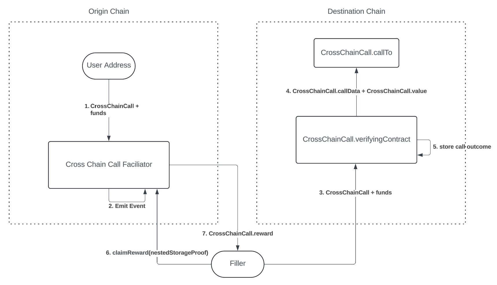

## Abstract 
Contracts for facilitating request, fulfillment, and fulfillment reward of cross-L2 calls.

## Motivation
Ethreum layer 2 (L2) users should have access to a public, decentralized utility for making cross L2 calls. 

From any L2 chain, users should be able to request a call be made on any other L2 chain. Users should be able to guarentee a compensation for this call being made, and thus be able to control the liklihood this call will be made. 

User should have full assurance that compensation will only be paid if the call was made. This assurance should depend ONLY on onchain information. 

Example uses our solution should enable
1. Pay on Chain A for a function call to happen on Chain B. 
1. Send native asset from Chain A to Chain B.
1. Send ERC20 asset from Chain A to Chain B. 
1. Fund a swap on Chain B with assets on Chain A.
1. Pay gas for a smart account transaction on Chain B using native asset on Chain A. 

## Specification
To only rely on onchain information, we use
1. L1 blockhashes on the L2. 
    - We take as an assumption that every L2 should have a trusted L1 blockhash in the execution environment. 
2. L2 blockhashes on the L1.
   - e.g. via an [L2 Output Oracle Contract](https://specs.optimism.io/glossary.html?#l2-output-oracle-contract)

Using these inputs, on any L2, we can trustlessly verify [ERC-1183](https://eips.ethereum.org/EIPS/eip-1186) storage proofs of any other L2. 

Our contracts' job, then, is to represent call requests and fulfillment in storage on each chain. 

### CrossChainCall Struct 
```solidity 

struct Call {
  // The address to call
  address to;
  // The calldata to call with
  bytes data;
  // The native asset value of the call
  uint256 value;
}

struct CrossChainCall {
  /// Array of calls to make on the destination chain
  Call[] calls;
  // The contract on origin chain where this cross-chain call request originated
  address originationContract;
  // The chainId of the origin chain
  uint originChainId;
  // The chainId of the destination chain
  uint destinationChainId;
  // The nonce of this call, to differentiate from other calls with the same values
  uint256 nonce;
  // The L2 contract on destination chain that's storage will be used to verify whether or not this call was made
  address verifyingContract;
  // The L1 address of the contract that should have L2 block info stored
  address l2Oracle;
  // The storage key at which we expect to find the L2 block info on the l2Oracle
  bytes32 l2OracleStorageKey;
  // The address of the ERC20 reward asset to be paid to whoever proves they filled this call
  // Native asset specified as in ERC-7528 format
  address rewardAsset;
  // The reward amount to pay 
  uint256 rewardAmount;
  // The minimum age of the L1 block used for the proof
  uint256 finalityDelaySeconds;
}

```

### CrossChainCallOriginator Contract
On the origin chain, there is an origination contract to receive cross-chain call requests and payout rewards on proof of their fulfillment. 

```solidity
pragma solidity ^0.8.23;

abstract contract CrossChainCallOriginator {

  enum CrossChainCallStatus {
    None,
    Requested,
    CancelRequested,
    Canceled,
    Completed
  }

  error InvalidValue(uint expected, uint received);
  error InvalidStatusForRequestCancel(CrossChainCallStatus status);
  error InvalidStatusForFinalizeCancel(CrossChainCallStatus status);

  event CrossChainCallRequested(bytes32 indexed callHash, CrossChainCall call);
  event CrossChainCallCancelRequested(bytes32 indexed callHash);
  event CrossChainCallCancelFinalized(bytes32 indexed callHash);

  mapping (bytes32 callHash => CrossChainCallStatus status) public requestStatus;
  mapping (bytes32 callHash => uint timestampSeconds) public cancelRequestedAt;

  /// @dev The duration, in excess of 
  /// CrossChainCall.finalityDelaySeconds, which must pass
  /// between requesting and finalizing a request cancellation
  uint public cancelDelaySeconds = 1 days;

  address internal NATIVE_ASSET = 0xEeeeeEeeeEeEeeEeEeEeeEEEeeeeEeeeeeeeEEeE;
  uint internal _nonce;

  function requestCrossChainCall(CrossChainCall memory crossChainCall) external payable {
    crossChainCall.nonce = ++_nonce;
    crossChainCall.originChainId = block.chainid;
    crossChainCall.originationContract = address(this);

    bytes32 hash = callHash(crossChainCall);
    requestStatus[hash] = CrossChainCallStatus.Requested;

    if (crossChainCall.rewardAsset == NATIVE_ASSET) {
      if (crossChainCall.rewardAmount != msg.value) {
        revert InvalidValue(crossChainCall.rewardAmount, msg.value);
      }
    } else {
      _pullERC20(msg.sender, crossChainCall.rewardAsset, crossChainCall.rewardAmount);
    }

    emit CrossChainCallRequested(hash, crossChainCall);
  }

  function claimReward(CrossChainCall calldata crossChainCall, bytes calldata storageProofData, address payTo) external payable {  
    bytes32 hash = callHashCalldata(crossChainCall);
    bytes32 storageKey = keccak256(
      abi.encodePacked(
        abi.encode(crossChainCall, msg.sender),
        uint(0) // Must be at slot 0
      )
    );
    
    _validate(storageKey, crossChainCall, storageProofData);
    requestStatus[hash] = CrossChainCallStatus.Completed;
    
    if (crossChainCall.rewardAsset == NATIVE_ASSET) {
      payable(payTo).call{value: crossChainCall.rewardAmount, gas: 100_000}("");
    } else { 
        _sendERC20(payTo, crossChainCall.rewardAsset, crossChainCall.rewardAmount);
    }

  }

  function requestCancel(CrossChainCall calldata crossChainCall) external {
    bytes32 hash = callHashCalldata(crossChainCall);
    CrossChainCallStatus status = requestStatus[hash];
    if (status != CrossChainCallStatus.Requested) {
      revert InvalidStatusForRequestCancel(status);
    }

    requestStatus[hash] = CrossChainCallStatus.CancelRequested;

    emit CrossChainCallCancelRequested(hash);
  }

  function finalizeCancel(CrossChainCall calldata crossChainCall) external {
    bytes32 hash = callHashCalldata(crossChainCall);
    CrossChainCallStatus status = requestStatus[hash];
    if (status != CrossChainCallStatus.CancelRequested) {
      revert InvalidStatusForFinalizeCancel(status);
    }

    requestStatus[hash] = CrossChainCallStatus.Canceled;

    emit CrossChainCallCancelFinalized(hash);
  }

  function callHash(CrossChainCall memory crossChainCall) public pure returns (bytes32) {
    return keccak256(abi.encode(crossChainCall));
  }

  function callHashCalldata(CrossChainCall calldata crossChainCall) public pure returns (bytes32) {
    return keccak256(abi.encode(crossChainCall));
  }

  /// @dev Validates storage proofs and verifies that 
  /// verifyingContractStorageKey on crossChainCall.verifyingContract 
  /// is set to `true`. Raises error if proof not valid or value not `true`.
  /// @dev Implementation will vary by L2
  function _validate(bytes32 verifyingContractStorageKey, CrossChainCall calldata crossChainCall, bytes calldata storageProofData) internal  view virtual;

  /// @notice Pulls `amount` of `asset` from `owner` to address(this)
  /// @dev Left abstract to minimize imports and maximize simplicity for this example
  function _pullERC20(address owner, address asset, uint256 amount) internal virtual;

  /// @notice Sends `amount` of `asset` to `to`
  /// @dev Left abstract to minimize imports and maximize simplicity for this example
  function _sendERC20(address to, address asset, uint256 amount) internal virtual;
}
```

### CrossChainCallFulfillment Contract
TODO

### Flow Diagrams

